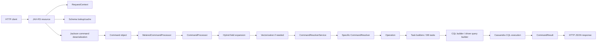
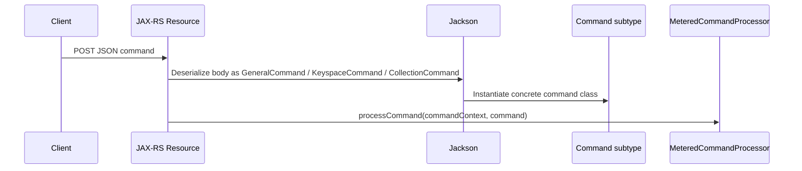
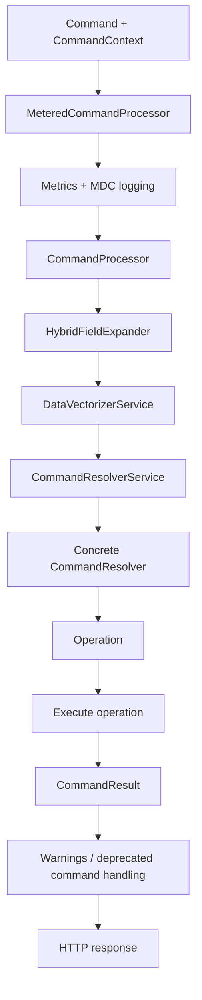
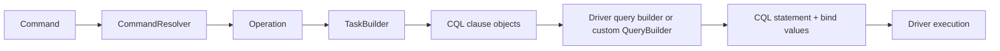
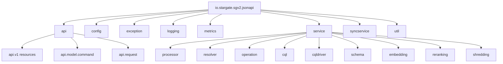
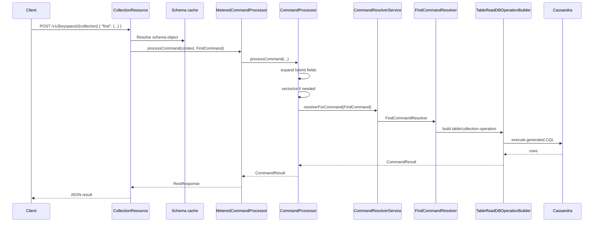

# Data API Architecture Explained

## Table of Contents

- [1. High-level view](#1-high-level-view)
- [2. Main endpoints](#2-main-endpoints)
- [3. Endpoint responsibilities](#3-endpoint-responsibilities)
  - [3.1 `POST /v1` — general commands](#31-post-v1--general-commands)
  - [3.2 `POST /v1/{keyspace}` — keyspace commands](#32-post-v1keyspace--keyspace-commands)
  - [3.3 `POST /v1/{keyspace}/{collection}` — collection/table commands](#33-post-v1keyspacecollection--collectiontable-commands)
- [4. How commands are parsed](#4-how-commands-are-parsed)
- [5. Request context and request metadata](#5-request-context-and-request-metadata)
- [6. Execution pipeline after parsing](#6-execution-pipeline-after-parsing)
- [7. What `MeteredCommandProcessor` does](#7-what-meteredcommandprocessor-does)
- [8. What `CommandProcessor` does](#8-what-commandprocessor-does)
- [9. How commands are resolved](#9-how-commands-are-resolved)
- [10. Example: how `find` is resolved](#10-example-how-find-is-resolved)
- [11. How commands become CQL](#11-how-commands-become-cql)
- [12. Main packages involved in CQL translation](#12-main-packages-involved-in-cql-translation)
- [13. Table read path in detail](#13-table-read-path-in-detail)
- [14. How SELECT CQL is built](#14-how-select-cql-is-built)
- [15. How INSERT commands become DB tasks](#15-how-insert-commands-become-db-tasks)
- [16. The custom `QueryBuilder`](#16-the-custom-querybuilder)
- [17. Filter translation](#17-filter-translation)
- [18. Sort translation](#18-sort-translation)
- [19. Vectorization and embeddings](#19-vectorization-and-embeddings)
- [20. Error handling model](#20-error-handling-model)
- [21. Observability and tracing](#21-observability-and-tracing)
- [22. Package structure you must know](#22-package-structure-you-must-know)
- [23. End-to-end example: `find`](#23-end-to-end-example-find)
- [24. What contributors must know](#24-what-contributors-must-know)
- [25. Short summary](#25-short-summary)
- [26. Source files referenced most in this explanation](#26-source-files-referenced-most-in-this-explanation)

This document explains how the Stargate Data API works in this repository, with a focus on:

- exposed HTTP endpoints
- how JSON commands are parsed
- how commands are resolved into executable operations
- how operations become CQL statements
- the package structure you need to know
- the main concepts and caveats contributors should understand

---

## 1. High-level view

The Data API is an HTTP JSON service in front of Cassandra-compatible storage.

At a high level, a request flows like this:



### Key ideas

- The API is **command-based**, not REST-resource CRUD in the classic sense.
- Each POST body contains **one command**, wrapped by its command name.
- The HTTP layer does **very little business logic**.
- The main pipeline is:
  - deserialize command
  - build request context
  - resolve schema
  - resolve command to operation
  - build tasks/CQL
  - execute
  - return `CommandResult`

---

## 2. Main endpoints

The main public API entry points are under:

- `src/main/java/io/stargate/sgv2/jsonapi/api/v1`

### Endpoint summary

| Endpoint | Resource class | Purpose |
|---|---|---|
| `POST /v1` | `GeneralResource` | database/global commands |
| `POST /v1/{keyspace}` | `KeyspaceResource` | keyspace-scoped commands |
| `POST /v1/{keyspace}/{collection}` | `CollectionResource` | collection/table-scoped commands |

---

## 3. Endpoint responsibilities

## 3.1 `POST /v1` — general commands

Handled by:

- `api/v1/GeneralResource.java`

Typical commands include:

- `createKeyspace`
- `findKeyspaces`
- `dropKeyspace`

### What this resource does

- receives a `GeneralCommand`
- resolves tenant/request metadata from `RequestContext`
- loads database schema object from `SchemaObjectCacheSupplier`
- builds a `CommandContext`
- delegates execution to `MeteredCommandProcessor`

### Important notes

- base path is `"/v1"`
- request body is a polymorphic command object
- response is always a `CommandResult` wrapped as HTTP response

---

## 3.2 `POST /v1/{keyspace}` — keyspace commands

Handled by:

- `api/v1/KeyspaceResource.java`

Typical commands include:

- `createCollection`
- `findCollections`
- `deleteCollection`
- table-oriented commands such as:
  - `createTable`
  - `dropTable`
  - `dropIndex`
  - `listTables`
  - `listTypes`
  - `createType`
  - `alterType`
  - `dropType`

### What this resource does

- receives a `KeyspaceCommand`
- converts path param `keyspace` into a CQL identifier
- resolves keyspace schema
- builds `CommandContext`
- delegates to `MeteredCommandProcessor`

### Important notes

- keyspace commands force schema refresh because many are DDL-oriented
- this layer does not translate commands to CQL directly

---

## 3.3 `POST /v1/{keyspace}/{collection}` — collection/table commands

Handled by:

- `api/v1/CollectionResource.java`

Typical commands include:

- document commands:
  - `find`
  - `findOne`
  - `insertOne`
  - `insertMany`
  - `updateOne`
  - `updateMany`
  - `deleteOne`
  - `deleteMany`
  - `findOneAndUpdate`
  - `findOneAndReplace`
  - `findOneAndDelete`
  - `countDocuments`
  - `estimatedDocumentCount`
- table/index commands:
  - `alterTable`
  - `createIndex`
  - `createTextIndex`
  - `createVectorIndex`
  - `listIndexes`

### What this resource does

- receives a `CollectionCommand`
- resolves `{keyspace}` and `{collection}` into schema identifiers
- fetches schema from cache
- detects vectorize configuration from schema
- optionally creates an `EmbeddingProvider`
- builds `CommandContext`
- delegates to `MeteredCommandProcessor`
- optionally refreshes schema cache after execution

### Important notes

- this endpoint serves both:
  - JSON collection semantics
  - table-backed semantics
- schema type determines which execution path is used:
  - `COLLECTION`
  - `TABLE`

---

## 4. How commands are parsed

The Data API uses Jackson polymorphic deserialization.

### Core command model

Main package:

- `api/model/command`

Important files:

- `Command.java`
- `CollectionCommand.java`
- `GeneralCommand.java`
- `KeyspaceCommand.java`
- `TableOnlyCommand.java`
- `CollectionOnlyCommand.java`

### How parsing works

`Command.java` is annotated with:

- `@JsonTypeInfo(use = JsonTypeInfo.Id.NAME, include = JsonTypeInfo.As.WRAPPER_OBJECT)`
- `@JsonSubTypes(...)`

That means the incoming JSON is expected to look like this shape:

```json
{
  "find": {
    "filter": { "name": "Alice" },
    "options": { "limit": 10 }
  }
}
```

The wrapper key (`find`) determines the concrete command class.

### Parsing flow



### Important parsing characteristics

- commands are **typed POJOs**
- commands represent **internal API grammar**, not raw JSON blobs
- validation is done with `jakarta.validation`
- command classes are intentionally separated from execution logic

### Why this matters

This design keeps wire format concerns separate from execution concerns:

- changing JSON shape mostly affects command parsing/deserialization
- execution logic stays in resolvers and operations

---

## 5. Request context and request metadata

Main package:

- `api/request`

Important file:

- `api/request/RequestContext.java`

### `RequestContext` contains

- tenant
- auth token
- request ID
- user agent
- embedding credentials
- reranking credentials
- feature flags derived from config + headers
- billing object
- schema registry

### Why it matters

Every command execution depends on request-scoped metadata for:

- tenant isolation
- auth propagation
- feature toggles
- logging/MDC
- embedding/reranking provider selection

---

## 6. Execution pipeline after parsing

The main execution path is implemented in:

- `service/processor/MeteredCommandProcessor.java`
- `service/processor/CommandProcessor.java`

### Pipeline summary



---

## 7. What `MeteredCommandProcessor` does

File:

- `service/processor/MeteredCommandProcessor.java`

### Responsibilities

- wraps the core processor
- starts/stops Micrometer timers
- adds MDC logging context
- records tags such as:
  - command name
  - tenant
  - error status
  - vector-enabled status
  - sort type
  - command feature flags
- emits command-level logs when enabled

### Why it exists

This class is an **observability wrapper** around the real execution engine.

It does **not** decide how commands work.
It measures and logs how they behaved.

---

## 8. What `CommandProcessor` does

File:

- `service/processor/CommandProcessor.java`

### Responsibilities

`CommandProcessor` is the core orchestration pipeline.

It performs these steps:

1. trace the start of processing
2. expand hybrid fields
3. vectorize command content if needed
4. resolve command into an `Operation`
5. execute the operation
6. recover failures into `CommandResult`
7. post-process warnings such as deprecated command warnings

### Important detail

The processor does **not** directly build CQL.
Instead, it delegates to:

- `CommandResolverService`
- concrete `CommandResolver` implementations
- `Operation` implementations
- task builders and CQL clause builders

---

## 9. How commands are resolved

Main package:

- `service/resolver`

Important files:

- `CommandResolverService.java`
- many `*CommandResolver.java` classes

Examples:

- `FindCommandResolver`
- `InsertOneCommandResolver`
- `UpdateOneCommandResolver`
- `CreateCollectionCommandResolver`
- `CreateKeyspaceCommandResolver`
- `CreateIndexCommandResolver`

### Resolver role

A resolver maps:

- **command object**
- plus **schema-aware command context**

into:

- **operation**

### Resolver lookup

`CommandResolverService` builds a map:

- key = command class
- value = matching resolver bean

So the flow is:

```text
Command class -> matching CommandResolver -> Operation
```

### Why this is important

Resolvers are the bridge between:

- API grammar
- schema-aware execution plan

They are where command semantics become executable behavior.

---

## 10. Example: how `find` is resolved

File:

- `service/resolver/FindCommandResolver.java`

### Table path

For table-backed schema:

- uses `TableReadDBOperationBuilder`
- resolves:
  - paging state
  - filters
  - sort
  - projection
  - limits
- builds a table read operation

### Collection path

For collection-backed schema:

- resolves collection filter expression
- interprets options:
  - `limit`
  - `skip`
  - `pageState`
  - `includeSimilarity`
  - `includeSortVector`
- validates sort clause
- chooses one of several execution modes:
  - vector search
  - BM25 search
  - in-memory sorted read
  - unsorted read

### Important takeaway

The same API command name can produce different execution strategies depending on:

- schema type
- sort mode
- vector search usage
- lexical/BM25 usage
- paging constraints

---

## 11. How commands become CQL

This is the most important internal concept.

The translation is **not**:

```text
HTTP resource -> raw CQL string
```

It is more like:

```text
Command -> Resolver -> Operation -> Task builder -> CQL clauses / QueryBuilder / driver query builder -> executable statement
```

### Translation layers



---

## 12. Main packages involved in CQL translation

### `service/operation`

This package contains executable operations and DB task abstractions.

Subpackages include:

- `collections`
- `tables`
- `keyspaces`
- `databases`
- `tasks`
- `query`
- `filters`
- `embeddings`
- `reranking`

### `service/operation/tables`

This is one of the most important packages for table-backed execution.

Key classes include:

- `TableReadDBTaskBuilder`
- `TableInsertDBTaskBuilder`
- `TableWhereCQLClause`
- `TableProjection`
- `TableOrderByANNCqlClause`
- `TableOrderByClusteringCqlClause`
- `TableOrderByLexicalCqlClause`
- `WhereCQLClauseAnalyzer`

### `service/cql`

Utility package for CQL-related helpers.

### `service/cql/builder`

Contains custom query builder classes:

- `QueryBuilder`
- `Query`

### `service/cqldriver`

Contains driver integration and execution support.

Subpackages include:

- `executor`
- `serializer`
- `override`

---

## 13. Table read path in detail

A good example is the table-backed `find` path.

File:

- `service/resolver/TableReadDBOperationBuilder.java`

### What it does

It assembles a read operation by combining:

- filter resolution
- CQL sort resolution
- in-memory sort fallback
- paging state
- projection
- where clause generation
- task grouping
- embedding-aware operation wrapping

### Main steps

- create `TableReadDBTaskBuilder`
- resolve order-by clause
- compute effective limit
- resolve in-memory sort if needed
- build projection
- build `TableWhereCQLClause`
- create task group
- create accumulator/page builder
- wrap in embedding-aware operation if needed

### Why this matters

This builder is where a high-level read command becomes a concrete DB execution plan.

---

## 14. How SELECT CQL is built

File:

- `service/operation/tables/TableReadDBTaskBuilder.java`

### Responsibilities

This builder creates a `ReadDBTask` using:

- select clause
- where clause
- order by clause
- paging state
- row sorter
- projection
- CQL options

### Important behavior

It also analyzes the where clause using:

- `WhereCQLClauseAnalyzer`

This can decide whether `ALLOW FILTERING` is required.

### Result

The output is a DB task that contains enough information to execute a Cassandra read.

---

## 15. How INSERT commands become DB tasks

File:

- `service/operation/tables/TableInsertDBTaskBuilder.java`

### Responsibilities

For insert operations, the builder:

- parses JSON documents into named values
- validates document shape and limits
- converts values into writable table rows
- creates one insert task per row/document
- accumulates deferrables and response behavior

### Important supporting concepts

- `JsonNamedValueContainerFactory`
- `WriteableTableRowBuilder`
- codec registries
- schema-aware row validation

### Why this matters

Insert translation is not just string generation.
It includes:

- JSON shredding
- schema validation
- type conversion
- row materialization

---

## 16. The custom `QueryBuilder`

File:

- `service/cql/builder/QueryBuilder.java`

This class is a custom builder for some query shapes.

### It supports

- `SELECT`
- selected columns
- function calls
- `COUNT`
- similarity functions
- `WHERE` expressions
- `ORDER BY ... ANN OF ?`
- `ORDER BY ... BM25 OF ?`
- `LIMIT`

### Important details

It builds:

- a CQL string
- a list of positional bind values

### Example capabilities

- vector ANN search
- BM25 lexical search
- similarity score projection
- nested boolean expressions for filters

### Simplified example output shape

```text
SELECT col1, col2
FROM ks.table
WHERE (a = ? AND b > ?)
ORDER BY $vector ANN OF ?
LIMIT 10
```

with bind values stored separately.

---

## 17. Filter translation

Main packages:

- `service/resolver/matcher`
- `service/operation/filters`
- `service/operation/tables`
- `api/model/command/clause/filter`

### What happens

Filter JSON from the command is translated into internal filter expressions, then into CQL-compatible clauses.

### Typical stages

- parse filter clause into command model
- resolve filter semantics against schema
- build logical expression tree
- convert to `WhereCQLClause`
- analyze whether query is legal / needs warnings / needs `ALLOW FILTERING`

### Important note

The system distinguishes between:

- collection semantics
- table semantics

Those are not always translated the same way.

---

## 18. Sort translation

Main packages:

- `api/model/command/clause/sort`
- `service/resolver/sort`
- `service/operation/tables`

### Supported sort styles include

- regular field sort
- vector ANN sort
- BM25 lexical sort
- in-memory sort fallback

### Important note

Not every sort can be pushed fully to Cassandra.

The resolver may choose:

- CQL-native sort
- ANN/BM25 query form
- in-memory sorting after fetch

---

## 19. Vectorization and embeddings

Main packages:

- `service/embedding`
- `service/embedding/operation`
- `service/embedding/gateway`
- `service/embedding/configuration`

### Where vectorization happens

In `CommandProcessor`, before resolver execution:

- `dataVectorizerService.vectorize(commandContext, cmd)`

### Why this matters

Commands may contain text that must be converted into vectors before query execution.

Also, `CollectionResource` may create an `EmbeddingProvider` based on schema vectorize configuration.

### Practical effect

A request may become:

- embedding generation first
- then vector search CQL/operation execution

---

## 20. Error handling model

### Main behavior

Errors are generally converted into `CommandResult` rather than surfacing as non-200 HTTP responses.

This is explicitly documented in the resource classes.

### Where handled

- `CommandProcessor.handleProcessingFailure(...)`
- `CommandResult`
- exception factories and exception packages

### Important note

This means API consumers must inspect the response body, not only the HTTP status code.

---

## 21. Observability and tracing

Main packages:

- `metrics`
- `logging`
- `api/model/command/tracing`

### Built-in observability includes

- Micrometer timers
- command feature tags
- tenant tagging
- MDC logging
- request tracing
- command-level structured logs

### Why contributors should know this

When adding a new command, you should preserve:

- metrics tagging
- tracing hooks
- MDC-safe execution
- warning/error propagation

---

## 22. Package structure you must know

Here is the most useful mental map of the codebase.



### Package-by-package summary

#### `api`
- HTTP entry points
- request parsing
- command model
- request-scoped metadata

#### `api/v1`
- public REST endpoints
- `GeneralResource`
- `KeyspaceResource`
- `CollectionResource`

#### `api/model/command`
- command interfaces and implementations
- clauses for filter/sort/update
- serializers/deserializers
- validation
- tracing

#### `api/request`
- tenant resolution
- token resolution
- request metadata
- feature/header access

#### `service/processor`
- top-level execution orchestration
- metrics/logging wrapper
- command pipeline

#### `service/resolver`
- command-to-operation translation
- schema-aware semantic resolution

#### `service/operation`
- executable operations
- DB tasks
- paging/accumulation
- query planning pieces

#### `service/operation/tables`
- table-specific CQL planning
- where/order/projection builders
- insert/read/update/delete task builders

#### `service/cql`
- CQL helper utilities

#### `service/cql/builder`
- custom query builder for select/vector/BM25 patterns

#### `service/cqldriver`
- Cassandra driver integration
- execution helpers
- serializers

#### `service/schema`
- schema objects
- schema cache
- schema identifiers
- collection/table type distinctions

#### `service/shredding`
- JSON-to-storage decomposition
- collection/table shredding helpers

#### `service/embedding`
- embedding provider integration
- vectorization pipeline

#### `service/reranking`
- reranking provider integration

#### `config`
- feature flags
- operational limits
- metrics/logging config
- database config

#### `exception`
- API/domain exceptions
- mapping to command errors

#### `metrics`
- metric names/tags/features

#### `util`
- shared helpers

---

## 23. End-to-end example: `find`

Here is a simplified end-to-end view for a `find` request.



---

## 24. What contributors must know

### Must-know design rules

- **Commands are data objects**, not execution objects.
- **Resolvers own semantic translation** from command to operation.
- **Operations/tasks own execution planning**.
- **CQL generation is distributed**, not centralized in one file.
- **Schema type matters everywhere**:
  - collection path
  - table path
- **Vector and lexical search are first-class execution modes**.
- **HTTP 200 does not guarantee success**; inspect `CommandResult.errors`.
- **Observability is part of the execution contract**, not optional decoration.

### Must-know implementation patterns

- add new commands under `api/model/command/impl`
- register them in the appropriate command interface subtype
- create a matching `*CommandResolver`
- ensure schema-specific behavior is explicit
- use existing task builders and clause builders where possible
- preserve warnings, tracing, and metrics behavior

### Must-know architectural distinction

There are effectively two execution styles in the same API:

- **collection/document-oriented behavior**
- **table-oriented behavior**

The same endpoint may route to different internal logic depending on schema metadata.

---

## 25. Short summary

### In one sentence

The Data API accepts a JSON command over HTTP, deserializes it into a typed command object, resolves it through schema-aware command resolvers into operations and DB tasks, translates those tasks into CQL or driver-built statements, executes them against Cassandra, and returns a structured `CommandResult`.

### In bullet points

- endpoints are command POST endpoints under `/v1`
- commands are parsed with Jackson polymorphic wrapper-object deserialization
- `RequestContext` carries tenant/auth/features/request metadata
- resources build `CommandContext` and delegate execution
- `MeteredCommandProcessor` adds metrics and logging
- `CommandProcessor` orchestrates expansion, vectorization, resolution, execution, and recovery
- `CommandResolverService` maps command classes to resolvers
- resolvers build operations
- operations use task builders and CQL clause builders
- table execution heavily relies on `service/operation/tables`
- custom CQL generation exists in `service/cql/builder/QueryBuilder`
- vector and BM25 search are integrated into the execution model
- results are returned as `CommandResult`, often with HTTP 200 even on logical failure

---

## 26. Source files referenced most in this explanation

### HTTP layer
- `src/main/java/io/stargate/sgv2/jsonapi/api/v1/GeneralResource.java`
- `src/main/java/io/stargate/sgv2/jsonapi/api/v1/KeyspaceResource.java`
- `src/main/java/io/stargate/sgv2/jsonapi/api/v1/CollectionResource.java`

### Request and command model
- `src/main/java/io/stargate/sgv2/jsonapi/api/request/RequestContext.java`
- `src/main/java/io/stargate/sgv2/jsonapi/api/model/command/Command.java`
- `src/main/java/io/stargate/sgv2/jsonapi/api/model/command/CollectionCommand.java`

### Processing pipeline
- `src/main/java/io/stargate/sgv2/jsonapi/service/processor/MeteredCommandProcessor.java`
- `src/main/java/io/stargate/sgv2/jsonapi/service/processor/CommandProcessor.java`

### Resolver layer
- `src/main/java/io/stargate/sgv2/jsonapi/service/resolver/CommandResolverService.java`
- `src/main/java/io/stargate/sgv2/jsonapi/service/resolver/FindCommandResolver.java`
- `src/main/java/io/stargate/sgv2/jsonapi/service/resolver/TableReadDBOperationBuilder.java`

### CQL/task building
- `src/main/java/io/stargate/sgv2/jsonapi/service/operation/tables/TableReadDBTaskBuilder.java`
- `src/main/java/io/stargate/sgv2/jsonapi/service/operation/tables/TableInsertDBTaskBuilder.java`
- `src/main/java/io/stargate/sgv2/jsonapi/service/cql/builder/QueryBuilder.java`
