# Data API — HCD OpenSearch Integration Plan

## Table of Contents

- [1. Top-Level Overview](#1-top-level-overview)
- [2. Architecture Overview](#2-architecture-overview)
- [3. Context — How HCD-to-OpenSearch Works](#3-context--how-hcd-to-opensearch-works)
  - [3.1 Constraints specific to Data API collections (super-shredded schema)](#31-constraints-specific-to-data-api-collections-super-shredded-schema)
- [4. Impacted Commands](#4-impacted-commands)
  - [4.1 `createCollection` — new `openSearch` option block](#41-createcollection--new-opensearch-option-block)
    - [4.1.1 Goal](#411-goal)
    - [4.1.2 How it works](#412-how-it-works)
    - [4.1.3 OpenSearch fields in the Data API Payload](#413-opensearch-fields-in-the-data-api-payload)
    - [4.1.4 Sample payloads](#414-sample-payloads)
    - [4.1.5 Implementation Tips (server)](#415-implementation-tips-server)
    - [4.1.6 Implementation Tips (clients)](#416-implementation-tips-clients)
  - [4.2 `findCollections` — return `openSearch` block in `explain` response](#42-findcollections--return-opensearch-block-in-explain-response)
    - [4.2.1 Goal](#421-goal)
    - [4.2.2 How it works](#422-how-it-works)
    - [4.2.3 OpenSearch fields in the Data API Payload](#423-opensearch-fields-in-the-data-api-payload)
    - [4.2.4 Sample payloads](#424-sample-payloads)
    - [4.2.5 Implementation Tips (server)](#425-implementation-tips-server)
    - [4.2.6 Implementation Tips (clients)](#426-implementation-tips-clients)
  - [4.3 `createOpenSearchIndex` — new DDL command for Tables](#43-createopensearchindex--new-ddl-command-for-tables)
    - [4.3.1 Goal](#431-goal)
    - [4.3.2 How it works](#432-how-it-works)
    - [4.3.3 OpenSearch fields in the Data API Payload](#433-opensearch-fields-in-the-data-api-payload)
    - [4.3.4 Sample payloads](#434-sample-payloads)
    - [4.3.5 Implementation Tips (server)](#435-implementation-tips-server)
    - [4.3.6 Implementation Tips (clients)](#436-implementation-tips-clients)
  - [4.4 `find` on Collections — new `$search` filter operator](#44-find-on-collections--new-search-filter-operator)
    - [4.4.1 Goal](#441-goal)
    - [4.4.2 How it works](#442-how-it-works)
    - [4.4.3 OpenSearch fields in the Data API Payload](#443-opensearch-fields-in-the-data-api-payload)
    - [4.4.4 Sample payloads](#444-sample-payloads)
    - [4.4.5 Implementation Tips (server)](#445-implementation-tips-server)
    - [4.4.6 Implementation Tips (clients)](#446-implementation-tips-clients)
  - [4.5 `find` on Tables — new `$search` filter operator](#45-find-on-tables--new-search-filter-operator)
    - [4.5.1 Goal](#451-goal)
    - [4.5.2 How it works](#452-how-it-works)
    - [4.5.3 OpenSearch fields in the Data API Payload](#453-opensearch-fields-in-the-data-api-payload)
    - [4.5.4 Sample payloads](#454-sample-payloads)
    - [4.5.5 Implementation Tips (server)](#455-implementation-tips-server)
    - [4.5.6 Implementation Tips (clients)](#456-implementation-tips-clients)
  - [4.6 `searchAggregate` — aggregations and faceted search](#46-searchaggregate--aggregations-and-faceted-search)
    - [4.6.1 Goal](#461-goal)
    - [4.6.2 How it works](#462-how-it-works)
    - [4.6.3 OpenSearch fields in the Data API Payload](#463-opensearch-fields-in-the-data-api-payload)
    - [4.6.4 Sample payloads](#464-sample-payloads)
    - [4.6.5 Implementation Tips (server)](#465-implementation-tips-server)
    - [4.6.6 Implementation Tips (clients)](#466-implementation-tips-clients)
  - [4.7 `countDocuments` with `$search` filter](#47-countdocuments-with-search-filter)
    - [4.7.1 Goal](#471-goal)
    - [4.7.2 How it works](#472-how-it-works)
    - [4.7.3 OpenSearch fields in the Data API Payload](#473-opensearch-fields-in-the-data-api-payload)
    - [4.7.4 Sample payloads](#474-sample-payloads)
    - [4.7.5 Implementation Tips (server)](#475-implementation-tips-server)
    - [4.7.6 Implementation Tips (clients)](#476-implementation-tips-clients)
  - [4.8 `deleteCollection` — also drops the OpenSearch index](#48-deletecollection--also-drops-the-opensearch-index)
    - [4.8.1 Goal](#481-goal)
    - [4.8.2 How it works](#482-how-it-works)
    - [4.8.3 Implementation Tips (server)](#483-implementation-tips-server)
    - [4.8.4 Implementation Tips (clients)](#484-implementation-tips-clients)
  - [4.9 `dropIndex` on Tables — drops the OpenSearch custom index](#49-dropindex-on-tables--drops-the-opensearch-custom-index)
    - [4.9.1 Goal](#491-goal)
    - [4.9.2 How it works](#492-how-it-works)
    - [4.9.3 Implementation Tips (server)](#493-implementation-tips-server)
    - [4.9.4 Implementation Tips (clients)](#494-implementation-tips-clients)
- [5. Cross-Cutting Concerns](#5-cross-cutting-concerns)
  - [5.1 Class hierarchy](#51-class-hierarchy)
  - [5.2 Schema version evolution](#52-schema-version-evolution)
  - [5.3 Error codes](#53-error-codes)
  - [5.4 `CollectionSchemaVersion`](#54-collectionschemaversion)
  - [5.5 `isSupported()` check in `IndexFactoryFromCql`](#55-issupported-check-in-indexfactoryfromcql)
  - [5.6 HCD feature flag](#56-hcd-feature-flag)
  - [5.7 Testing](#57-testing)
  - [5.8 Write consistency and read-after-write guarantees](#58-write-consistency-and-read-after-write-guarantees)
- [6. Appendix — `OpenSearchQueryBuilder` API Reference](#6-appendix--opensearchquerybuilder-api-reference)
  - [6.1 Query builders](#61-query-builders)
  - [6.2 Aggregation builders](#62-aggregation-builders)
  - [6.3 Sort builders](#63-sort-builders)
  - [6.4 Cross-language usage summary](#64-cross-language-usage-summary)

---

## 1. Top-Level Overview

> ### Terminology — two names, two systems
> Every OpenSearch-backed table carries **two completely separate index names** that are used in different places and must never be confused. This distinction appears throughout the entire document; keeping it clear is essential to understanding the API design.
>
> | Term | Definition | Where it appears |
> |---|---|---|
> | **SAI index name** | The Cassandra custom index identifier — the name after `CREATE CUSTOM INDEX … IF NOT EXISTS`. Used inside CQL `expr(<sai-index-name>, …)` predicates. For **collections** it is always auto-generated as `hcd_<keyspace>_<collectionName>` and is **not user-configurable**. For **tables** it is the `name` field supplied to `createOpenSearchIndex` and **is user-configurable**. | CQL statements, `expr(...)` calls, all server-side routing |
> | **OS index name** | The OpenSearch index name — the value of the `'indexName'` key inside the CQL `WITH OPTIONS` block. This is the index that OpenSearch actually stores and searches. For **collections** it is configurable via `openSearch.indexName`; for **tables** it is configurable via `definition.options.openSearchIndexName`. When omitted it defaults to `hcd_<keyspace>_<tableName>`. | OpenSearch REST API, `WITH OPTIONS 'indexName'` |
>
> A single CQL statement carries both: `CREATE CUSTOM INDEX IF NOT EXISTS <sai-index-name> … WITH OPTIONS = {'indexName': '<os-index-name>', …}`. The two names may be identical (the default) or different (when the user sets `indexName`).

**Goal:** Extend the Data API to expose the new HCD OpenSearch replication capability, which mirrors Cassandra writes to an OpenSearch index in real time. This surfaces nine impacted API surfaces:

1. **Collection creation** — a new `openSearch` option block in `createCollection` that configures the underlying `CREATE CUSTOM INDEX … USING 'OpenSearchIndex'` on the super-shredded collection table.
2. **Collection introspection** — `findCollections` with `explain: true` returns the resolved `openSearch` block (including the auto-generated OS index name) for collections that have OpenSearch enabled.
3. **Collection `find`** — a new `$search` operator in the filter clause that routes the query to OpenSearch via CQL `expr(<saiIndexName>, '<OpenSearch JSON>')`.
4. **Table index creation** — a dedicated `createOpenSearchIndex` command (parallel to `createTextIndex` / `createVectorIndex`) that creates the same OpenSearch custom index on a user-defined table.
5. **Table `find`** — the same `$search` operator is made available on table reads, backed by `expr(...)`.
6. **Aggregations** — a new `searchAggregate` command that passes OpenSearch aggregation DSL (`aggs`) through `expr(...)` and returns structured facet / metric results.
7. **`countDocuments` with `$search`** — the existing `countDocuments` command is extended to accept a `$search` filter and return the OpenSearch `numFound` count.
8. **Collection deletion** — `deleteCollection` must also drop the OpenSearch custom index before dropping the table; same API signature, new implementation step.
9. **Table index deletion** — `dropIndex` must handle `indexType: openSearch`; dropping the Cassandra custom index causes HCD to also delete the OS index from the OpenSearch cluster.

> **`$search` is exclusive — it cannot be combined with regular field filters.** The `$search` key must always be the only key in the `filter` object. This is a fundamental CQL constraint: HCD's `expr(...)` predicate takes full ownership of the read path and cannot be ANDed with ordinary column predicates. See §3 for the full explanation. The same exclusivity rule applies everywhere `$search` is accepted: `find`, `findOne`, `findOneAndUpdate`, and all other commands that accept a filter.

**Scope constraints (what this plan does NOT cover):**
- Any changes to the HCD / OpenSearch replication component itself.
- Dynamic schema / custom mapping management — the initial API surfaces sensible defaults; advanced mapping is an operator-level concern.
- Backfill / rebuild operations are not part of the Data API surface.
- OpenSearch highlighting, autocomplete/suggest, and scroll cursor — not feasible because `expr(...)` → CQL row conversion drops all OpenSearch hit metadata (see discussion docs).

---

## 2. Architecture Overview

> **Note:** The diagrams below are intentionally simplified — they show the core write and read paths only. DDL commands (`createCollection`, `createOpenSearchIndex`), `countDocuments`, `searchAggregate`, and `listCollections` follow the same structural patterns and are covered in their respective sections (§4.1–§4.7) rather than here.

> **Diagram 1a — Write path.** Every document write is automatically mirrored to OpenSearch by HCD with no Data API involvement beyond the initial DDL.

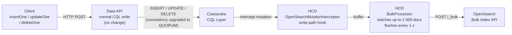

> **Diagram 1b — Read path.** `$search`, `searchAggregate`, and `countDocuments` with `$search` all follow this path. The Data API serialises the OpenSearch DSL into a CQL `expr(saiIndexName, dsl)` predicate; HCD intercepts it, queries OpenSearch for matching PKs, and returns the corresponding Cassandra rows.

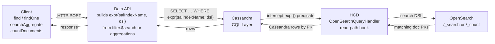

---

## 3. Context — How HCD-to-OpenSearch Works

The HCD OpenSearch component hooks into the **Cassandra write path** (`OpenSearchMutatorInterceptor`) and replicates every mutation in real time to a connected OpenSearch cluster. The feature is activated per-table by creating a single special Cassandra custom index.

> **Two distinct names.** Every OpenSearch-backed Cassandra table carries **two separate index names** that serve completely different purposes and must never be confused:
> - **SAI index name** — the Cassandra custom index identifier (the name after `CREATE CUSTOM INDEX … IF NOT EXISTS`). This name is used inside CQL `expr()` predicates to route a query to the HCD OpenSearch handler. For collections the Data API auto-generates it as `hcd_<keyspace>_<collectionName>`; for tables the user supplies it via the `name` field of `createOpenSearchIndex`.
> - **OS index name** — the OpenSearch index name, passed as the `'indexName'` key inside the CQL `WITH OPTIONS` block. This is the index that OpenSearch actually stores and searches. It can be set freely and independently of the SAI index name; when omitted it also defaults to `hcd_<keyspace>_<tableName>`.

```cql
CREATE CUSTOM INDEX IF NOT EXISTS <sai-index-name>
ON <keyspace>.<table> (<columns>)
USING 'OpenSearchIndex'
WITH OPTIONS = {
    'indexName':              '<os-index-name>',
    'createIndexIfNotExists': 'true',
    'unpackJsonFields':       'doc_json',
    'propertiesFromJsonFields': 'field1,field2'
};
```

Only **one** OpenSearch custom index (and therefore one OS index) is allowed per Cassandra table. Querying goes through a CQL custom expression that references the **SAI index name**:

```cql
SELECT * FROM <table> WHERE expr(<sai-index-name>, '<OpenSearch-query-JSON>')
```

> **`expr(...)` must be the sole predicate — no AND with regular column filters.** HCD's `OpenSearchQueryHandler` intercepts the `expr(...)` predicate and takes over the entire row-fetch path: it queries OpenSearch for matching PKs and returns the corresponding Cassandra rows directly. Because the handler owns the full result set, `expr(...)` cannot be mixed with regular CQL predicates (`column = value`, `IN`, range clauses, etc.) in the same `WHERE` clause. Any attempt to do so is rejected at the CQL layer. This is a CQL/HCD constraint, not a Data API design choice, and it is why the Data API `$search` filter must always be the **only** key in the filter object — there is no way to push additional predicates down to the same CQL query. Post-fetch filtering (in-memory) is technically possible but is not supported in this version.

### 3.1 Constraints specific to Data API collections (super-shredded schema)

The collection shredding model (`SuperShreddingMetadata`) stores the raw JSON in `doc_json TEXT` alongside auxiliary indexing columns (`exist_keys`, `query_text_values`, etc.). To make document fields searchable in OpenSearch:

The following four `WITH OPTIONS` keys are **always required** for collections — confirmed by integration testing. There is no optional or auto-inferred path:

1. **`unpackJsonFields: 'doc_json'`** — HCD must parse the JSON blob and merge properties at the OS document root.
2. **`propertiesFromJsonFields: '<fields>'`** — acts as the allow-list of fields to extract. Must **never** include `_id` — OpenSearch permanently rejects `_id` as a body field (`mapper_parsing_exception`), no mapping can override this.
3. **`applyCustomSchema: 'true'` + `customMappingsJson: '<json>'`** — required because the Cassandra column is `doc_json TEXT` with no typed schema; `applyDefaultSchema: 'true'` has no schema to work from. The `customMappingsJson` must cover the same fields listed in `propertiesFromJsonFields` and must **not** include an `_id` entry (that field is injected by the Data API automatically as `{"type":"keyword"}`).
4. **`applyDefaultSchema: 'false'`** — must accompany `applyCustomSchema: 'true'`.

- The feature is configured at **collection creation time** and is **immutable** afterward (same as `lexical` and `rerank`), because OpenSearch mappings cannot be changed after index creation.
- Consistency level for writes to OS-indexed tables is automatically upgraded by HCD (ANY/ONE/LOCAL_ONE → QUORUM).

> **`_id` handling in OpenSearch documents:** Every Data API document carries an `_id` field in `doc_json` (e.g. `{"_id":"p1","firstName":"Alice",...}`). When HCD unpacks `doc_json` it sends all fields — including `_id` — into the OpenSearch document body. OpenSearch **always rejects** `_id` as a body field because it is a reserved metadata field handled at the transport layer; no mapping can override this. The workaround is `propertiesFromJsonFields`, which acts as an allow-list that excludes `_id`. The resulting OpenSearch document shape is therefore:
> ```json
> {
>   "_index": "searchdemo-persons",
>   "_id":    "{_0=1, _1=p5}",
>   "_score": 1.0,
>   "_source": {
>     "firstName": "Diana",
>     "lastName":  "Brown",
>     "city":      "London",
>     "age":       51,
>     "key":       { "_0": 1, "_1": "p5" }
>   }
> }
> ```
> - The OpenSearch `_id` (metadata) is the **Cassandra composite primary key** in `{_0=<partitionKey>, _1=<clusteringKey>}` format — this is what HCD uses to route updates and deletes correctly.
> - The `key` field in `_source` is the decoded Cassandra primary key included automatically by HCD.
> - The user document fields (`firstName`, `lastName`, `city`, `age`) are present because they were listed in `propertiesFromJsonFields`.
> - The original Data API `_id` (`"p5"`) is **not** present in `_source` — it is intentionally excluded by the `propertiesFromJsonFields` allow-list.

> **Diagram 2a — Write path.** Each row holds ~3 steps. The flow zigzags top-to-bottom so every node is readable at normal zoom.

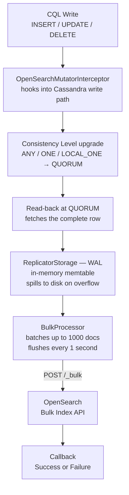

---

> **Diagram 2b — Read path.** Each row holds ~3 steps. The `expr(...)` cycle between `OpenSearchQueryHandler` and OpenSearch is shown explicitly.

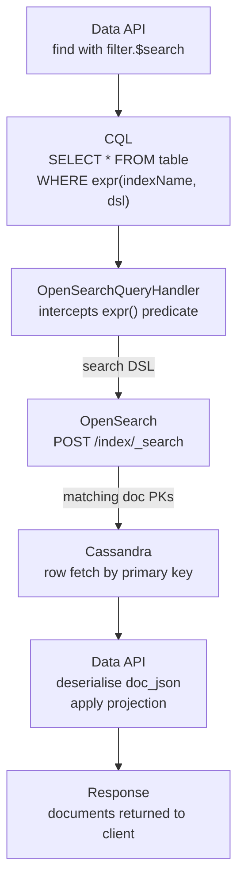

---

## 4. Impacted Commands

---

### 4.1 `createCollection` — new `openSearch` option block

#### 4.1.1 Goal

`createCollection` gains a new optional `openSearch` block inside `options`. Setting `enabled: true` tells the Data API to create an OpenSearch replication index alongside the normal Cassandra collection table. From that point on, every document write is automatically mirrored to OpenSearch by HCD — no extra client action required. The block also controls which document fields are replicated, how the OS index is named, and whether the initial full-table backfill is skipped for large pre-existing data sets.

> **SAI index name vs. OS index name for collections.** When `openSearch.enabled: true` is set, the Data API emits a `CREATE CUSTOM INDEX` statement that carries **two separate names**:
> - The **SAI index name** (the Cassandra identifier, e.g. `hcd_mykeyspace_products`) is **always auto-generated** by the Data API as `hcd_<keyspace>_<collectionName>`. It cannot be chosen by the user. This name is what appears in CQL `expr(hcd_mykeyspace_products, ...)` queries and what HCD uses internally.
> - The **OS index name** (the OpenSearch index, e.g. `articles-full-text`) is set via the `openSearch.indexName` field and **can be chosen freely** by the user. When omitted it also defaults to `hcd_<keyspace>_<collectionName>`.
>
> This is the same freedom/constraint trade-off as the rest of collection settings: the user does not choose the SAI names of any of the collection's associated indexes (SAI, lexical, vector), but they do retain full control over the OS index name.

#### 4.1.2 How it works

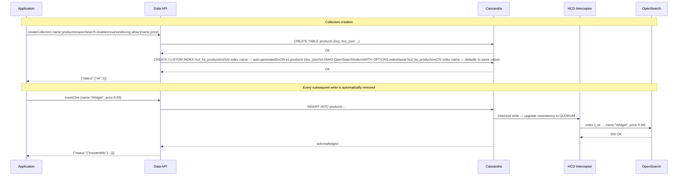

#### 4.1.3 OpenSearch fields in the Data API Payload

> **Why `mappings` is always required for collections.** The HCD connector always needs three things: (1) `propertiesFromJsonFields` — the allow-list of top-level fields to extract from `doc_json`, critically **excluding `_id`**; (2) `customMappingsJson` — the explicit OS field mapping, because `applyDefaultSchema: 'true'` cannot work (the only Cassandra column is `doc_json TEXT` — no typed schema to derive from); (3) `applyCustomSchema: 'true'` + `applyDefaultSchema: 'false'`. The Data API derives both `propertiesFromJsonFields` (the top-level keys of `mappings`) and `customMappingsJson` from the single `mappings` field. `customMappingsJson` is built by wrapping `mappings` under `{"properties":{...}}` and prepending `"_id":{"type":"keyword"}` as the first property, then serialising the whole object to a JSON string. Omitting `mappings` returns `OPEN_SEARCH_MISSING_FIELD_MAPPINGS`.

| Field | Required | Default | Description |
|---|---|---|---|
| `enabled` | **yes** | — | `true` activates OpenSearch replication. `false` (or omitting the block) is a no-op. |
| `indexName` | no | `hcd_<keyspace>_<collectionName>` | **OS index name** — the name of the OpenSearch index (passed as `'indexName'` in `WITH OPTIONS`). Leave unset to use the auto-generated default. Note: the **SAI index name** (the Cassandra custom index identifier used in `expr(...)`) is always auto-generated as `hcd_<keyspace>_<collectionName>` and cannot be configured here. |
| `numShards` | no | *(HCD default)* | Number of primary shards for the OS index. When omitted, HCD uses its own default (currently `1`). |
| `numReplicas` | no | *(HCD default)* | Number of replicas for the OS index (analogous to Cassandra replication factor). When omitted, HCD uses its own default. |
| `mappings` | **yes** | — | Map of **top-level** document field name → OpenSearch field definition. The Data API derives `propertiesFromJsonFields` (the key set) and `customMappingsJson` (built as `{"properties":{"_id":{"type":"keyword"}, ...mappings}}` serialised to a JSON string) from this single field. **`_id` must never appear as a key** — it is a reserved OpenSearch metadata field and is injected automatically. For nested objects, use `{"type":"object"}` or a `{"properties":{...}}` block (HCD passes `customMappingsJson` verbatim to the OpenSearch Create Index API — confirmed). See the type reference below. |

**OpenSearch field type reference for collections**

| Type | Use for | Example |
|---|---|---|
| `text` | Full-text search with analysis (tokenised, lowercased) | `{"type":"text"}` or `{"type":"text","analyzer":"english"}` |
| `keyword` | Exact match, sorting, aggregations — short strings, enums, IDs | `{"type":"keyword"}` |
| `integer` | 32-bit whole numbers | `{"type":"integer"}` |
| `long` | 64-bit whole numbers | `{"type":"long"}` |
| `float` | 32-bit decimals | `{"type":"float"}` |
| `double` | 64-bit decimals | `{"type":"double"}` |
| `boolean` | `true` / `false` | `{"type":"boolean"}` |
| `date` | ISO-8601 strings or epoch millis | `{"type":"date"}` |
| `object` | Nested JSON object — all sub-fields automatically indexed and queryable as `parent.child` in the DSL | `{"type":"object"}` or `{"properties":{...}}` |
| `nested` | Array of objects where sub-fields must be queried as independent units (avoids cross-element matches) | `{"type":"nested"}` |
| `knn_vector` | Dense vector for OpenSearch k-NN (advanced — see §4.4.4) | `{"type":"knn_vector","dimension":1536}` |

> **`object` — two equivalent syntaxes, both confirmed working.** HCD passes `customMappingsJson` verbatim to the OpenSearch Create Index API, so both forms work:
> - **Simple:** `"address": {"type": "object"}` — OpenSearch auto-detects sub-field types from the first document. Sub-fields are immediately queryable as `address.city`, `address.zip`, etc.
> - **With explicit sub-field types:** `"address": {"properties": {"city": {"type": "keyword"}, "zip": {"type": "keyword"}}}` — pins sub-field types precisely. `"type": "object"` is implicit when `"properties"` is present. Recommended when you need exact-match (`keyword`) vs full-text (`text`) control.

> **`nested` — use only for arrays of objects.** If `reviews` is `[{"score": 5, "author": "Alice"}, {"score": 3, "author": "Bob"}]` and you need a query to match only when *the same review* satisfies both conditions, use `nested`. Without it, OpenSearch flattens all values across array elements. For most collection use cases `object` is sufficient.

> **Constraint — `indexing.deny` is rejected:** `openSearch.enabled: true` cannot be combined with `indexing.deny`. This is a **technical constraint** — `propertiesFromJsonFields` is inherently an allow-list with no deny-list equivalent. Use `indexing.allow` or `openSearch.mappings` to control replication scope. Violating this rule returns `OPEN_SEARCH_INCOMPATIBLE_WITH_DENY_LIST`.

> **Constraint — `indexing.allow` filters the OpenSearch mapping:** When `indexing.allow` is also present, the Data API automatically filters `propertiesFromJsonFields` and `customMappingsJson` to the **intersection** of the `openSearch.mappings` keys and the `indexing.allow` field list. Fields listed in `openSearch.mappings` that are NOT in `indexing.allow` are silently dropped from the OpenSearch replication. This ensures that a field excluded from SAI indexing is also excluded from OpenSearch replication. If the intersection is empty (no mapping key survives the allow-list), the request is rejected with `OPEN_SEARCH_MISSING_FIELD_MAPPINGS`.

**Relationship to other search capabilities**

The `openSearch` block is a deliberate, explicit gate — the same model as hybrid, not lexical. It must be declared at creation time; using `$search` on a collection that was not created with `openSearch.enabled: true` returns `OPEN_SEARCH_NOT_ENABLED`.

| Capability | Declared at creation | Search operator | Gated |
|---|---|---|---|
| Lexical (SAI text index) | `lexical.enabled: true` | `$match` | No |
| Hybrid (vector + lexical) | `vector` + `lexical` both present | `$hybrid` | Yes |
| OpenSearch replication | `openSearch.enabled: true` | `$search` | Yes |

`openSearch` can be combined with `lexical`, `vector`, or both at creation time — each search operator remains independent and exclusive per query.

#### 4.1.4 Sample payloads

> **Every `createCollection` payload with `openSearch.enabled: true` must include `mappings`.** This is always required — see §4.1.3 for the reasoning.

---

**Minimal — basic fields, default OS index name:**
```json
{
  "createCollection": {
    "name": "persons",
    "options": {
      "openSearch": {
        "enabled": true,
        "mappings": {
          "firstName": { "type": "text" },
          "lastName":  { "type": "text" },
          "city":      { "type": "text" },
          "age":       { "type": "integer" }
        }
      }
    }
  }
}
```
→ CQL emitted (SAI index name and OS index name both default to `hcd_mykeyspace_persons`):
```cql
CREATE CUSTOM INDEX IF NOT EXISTS hcd_mykeyspace_persons
ON mykeyspace.persons (doc_json)
USING 'OpenSearchIndex'
WITH OPTIONS = {
  'indexName':               'hcd_mykeyspace_persons',
  'createIndexIfNotExists':  'true',
  'unpackJsonFields':        'doc_json',
  'applyDefaultSchema':      'false',
  'applyCustomSchema':       'true',
  'customMappingsJson':      '{"properties":{"_id":{"type":"keyword"},"firstName":{"type":"text"},"lastName":{"type":"text"},"city":{"type":"text"},"age":{"type":"integer"}}}',
  'propertiesFromJsonFields':'firstName,lastName,city,age'
};
```

> The Data API derives `propertiesFromJsonFields` from the keys of `mappings` (`firstName,lastName,city,age`) and builds `customMappingsJson` by wrapping `mappings` under `{"properties":{...}}` with `_id` prepended as the first entry, then serialising to a JSON string.

---

**With explicit OS index name and English text analyzer:**
```json
{
  "createCollection": {
    "name": "articles",
    "options": {
      "openSearch": {
        "enabled": true,
        "indexName": "articles-full-text",
        "mappings": {
          "title":       { "type": "text", "analyzer": "english" },
          "body":        { "type": "text", "analyzer": "english" },
          "author":      { "type": "keyword" },
          "publishedAt": { "type": "date" }
        }
      }
    }
  }
}
```

---

**`indexing.allow` + `openSearch.mappings` — fields filtered to the intersection:**
```json
{
  "createCollection": {
    "name": "articles",
    "options": {
      "indexing": {
        "allow": ["category", "price", "publishedAt", "title", "author"]
      },
      "openSearch": {
        "enabled": true,
        "indexName": "articles-full-text",
        "mappings": {
          "title":  { "type": "text", "analyzer": "english" },
          "body":   { "type": "text", "analyzer": "english" },
          "author": { "type": "keyword" }
        }
      }
    }
  }
}
```

> `category`, `price`, `publishedAt`, `title`, and `author` are SAI-indexed. `title`, `body`, and `author` are declared in `openSearch.mappings`. The intersection is `title` and `author` — only those two fields are passed to `propertiesFromJsonFields` and included in `customMappingsJson`. `body` is dropped from the OpenSearch mapping because it is not in `indexing.allow`. The CQL emitted is:
> ```cql
> CREATE CUSTOM INDEX IF NOT EXISTS hcd_mykeyspace_articles
> ON mykeyspace.articles (doc_json)
> USING 'OpenSearchIndex'
> WITH OPTIONS = {
>   'indexName':               'articles-full-text',
>   'createIndexIfNotExists':  'true',
>   'unpackJsonFields':        'doc_json',
>   'applyDefaultSchema':      'false',
>   'applyCustomSchema':       'true',
>   'customMappingsJson':      '{"properties":{"_id":{"type":"keyword"},"title":{"type":"text","analyzer":"english"},"author":{"type":"keyword"}}}',
>   'propertiesFromJsonFields':'title,author'
> };
> ```

---

**With a nested `object` field — dynamic sub-field detection:**
```json
{
  "createCollection": {
    "name": "orders",
    "options": {
      "openSearch": {
        "enabled": true,
        "mappings": {
          "customerName": { "type": "keyword" },
          "status":       { "type": "keyword" },
          "address":      { "type": "object" }
        }
      }
    }
  }
}
```

> `address` is declared as `object` — OpenSearch auto-detects sub-field types from the first document and makes them queryable as `address.city`, `address.zip`, etc. in the `$search` DSL.

---

**With a nested `object` field — explicit sub-field types:**
```json
{
  "createCollection": {
    "name": "orders",
    "options": {
      "openSearch": {
        "enabled": true,
        "mappings": {
          "customerName": { "type": "keyword" },
          "status":       { "type": "keyword" },
          "address": {
            "properties": {
              "city":    { "type": "keyword" },
              "country": { "type": "keyword" },
              "zip":     { "type": "keyword" }
            }
          }
        }
      }
    }
  }
}
```

> `"type": "object"` is implicit when `"properties"` is present. This form pins sub-field types precisely — use it when you need exact-match (`keyword`) vs full-text (`text`) control on sub-fields.

---

**Combined with vector search — ANN and full-text search on the same collection:**
```json
{
  "createCollection": {
    "name": "knowledge_base",
    "options": {
      "vector": {
        "dimension": 1536,
        "metric": "cosine",
        "service": {
          "provider": "openai",
          "modelName": "text-embedding-ada-002"
        }
      },
      "openSearch": {
        "enabled": true,
        "mappings": {
          "title":   { "type": "text", "analyzer": "english" },
          "content": { "type": "text", "analyzer": "english" },
          "tags":    { "type": "keyword" },
          "source":  { "type": "keyword" }
        }
      }
    }
  }
}
```

---

**Error — `mappings` missing (always required):**
```json
{
  "createCollection": {
    "name": "products",
    "options": {
      "openSearch": {
        "enabled": true
      }
    }
  }
}
```
Response:
```json
{
  "errors": [{
    "message": "openSearch.mappings is required. There is no auto-inference path for collections.",
    "errorCode": "OPEN_SEARCH_MISSING_FIELD_MAPPINGS"
  }]
}
```

---

**Error — `_id` present in `mappings`:**
```json
{
  "createCollection": {
    "name": "products",
    "options": {
      "openSearch": {
        "enabled": true,
        "mappings": {
          "_id":   { "type": "keyword" },
          "name":  { "type": "text" },
          "price": { "type": "double" }
        }
      }
    }
  }
}
```
Response:
```json
{
  "errors": [{
    "message": "'_id' must not appear as a key in openSearch.mappings. It is a reserved OpenSearch metadata field and is injected automatically.",
    "errorCode": "OPEN_SEARCH_MISSING_FIELD_MAPPINGS"
  }]
}
```

---

**Error — `indexing.deny` combined with `openSearch.enabled: true` is rejected:**
```json
{
  "createCollection": {
    "name": "users",
    "options": {
      "indexing": {
        "deny": ["password_hash", "ssn"]
      },
      "openSearch": {
        "enabled": true,
        "mappings": {
          "username": { "type": "keyword" },
          "email":    { "type": "text" }
        }
      }
    }
  }
}
```
Response:
```json
{
  "errors": [{
    "message": "openSearch cannot be enabled when 'indexing.deny' is set. Use 'indexing.allow' or 'openSearch.mappings' to specify which fields to replicate.",
    "errorCode": "OPEN_SEARCH_INCOMPATIBLE_WITH_DENY_LIST"
  }]
}
```

---

**Error — `indexing.allow` present but intersection with `openSearch.mappings` keys is empty:**
```json
{
  "createCollection": {
    "name": "products",
    "options": {
      "indexing": {
        "allow": ["category", "price"]
      },
      "openSearch": {
        "enabled": true,
        "mappings": {
          "title":       { "type": "text", "analyzer": "english" },
          "description": { "type": "text", "analyzer": "english" }
        }
      }
    }
  }
}
```
Response:
```json
{
  "errors": [{
    "message": "openSearch.mappings contains no fields that are in 'indexing.allow'. The intersection of openSearch.mappings keys and indexing.allow is empty — no fields would be replicated to OpenSearch.",
    "errorCode": "OPEN_SEARCH_MISSING_FIELD_MAPPINGS"
  }]
}
```

#### 4.1.5 Implementation Tips (server)

**CQL emitted**

When `openSearch.enabled: true` the Data API executes a second CQL statement immediately after `CREATE TABLE`. The same five `WITH OPTIONS` keys are **always present** for every collection OpenSearch index — they are not conditional:

- `applyDefaultSchema: 'false'` — always. The only Cassandra column is `doc_json TEXT`; there is no typed schema to derive a mapping from.
- `applyCustomSchema: 'true'` + `customMappingsJson` — always. The Data API builds `customMappingsJson` by constructing `{"properties":{"_id":{"type":"keyword"}, <mappings entries>}}` and serialising the result to a JSON string. The `_id` entry is injected automatically as the first property — it must not appear in `mappings`.
- `propertiesFromJsonFields` — always. Built from the **effective field set** as a comma-separated string. When `indexing.allow` is also present, this is the **intersection** of `openSearch.mappings` top-level keys and the `indexing.allow` field list; when `indexing.allow` is absent it is simply the top-level keys of `openSearch.mappings`. `_id` is always excluded (validated at request time). An empty intersection is rejected with `OPEN_SEARCH_MISSING_FIELD_MAPPINGS`.
- `unpackJsonFields: 'doc_json'` — always. Required so HCD parses the JSON blob.

*Standard example — `persons` collection, default OS index name:*
```cql
-- SAI index name: hcd_mykeyspace_persons   (Cassandra identifier, used in expr())
-- OS index name:  hcd_mykeyspace_persons   (OpenSearch index — defaults to same value)
CREATE CUSTOM INDEX IF NOT EXISTS hcd_mykeyspace_persons
ON mykeyspace.persons (doc_json)
USING 'OpenSearchIndex'
WITH OPTIONS = {
  'indexName':               'hcd_mykeyspace_persons',
  'createIndexIfNotExists':  'true',
  'unpackJsonFields':        'doc_json',
  'applyDefaultSchema':      'false',
  'applyCustomSchema':       'true',
  'customMappingsJson':      '{"properties":{"_id":{"type":"keyword"},"firstName":{"type":"text"},"lastName":{"type":"text"},"city":{"type":"text"},"age":{"type":"integer"}}}',
  'propertiesFromJsonFields':'firstName,lastName,city,age'
};
```

*With explicit OS index name and English analyzer (OS index name `articles-full-text` differs from SAI index name `hcd_mykeyspace_articles`):*
```cql
-- SAI index name: hcd_mykeyspace_articles  (Cassandra identifier, used in expr())
-- OS index name:  articles-full-text        (OpenSearch index, set via 'indexName' in WITH OPTIONS)
CREATE CUSTOM INDEX IF NOT EXISTS hcd_mykeyspace_articles
ON mykeyspace.articles (doc_json)
USING 'OpenSearchIndex'
WITH OPTIONS = {
  'indexName':               'articles-full-text',
  'createIndexIfNotExists':  'true',
  'unpackJsonFields':        'doc_json',
  'applyDefaultSchema':      'false',
  'applyCustomSchema':       'true',
  'customMappingsJson':      '{"properties":{"_id":{"type":"keyword"},"title":{"type":"text","analyzer":"english"},"body":{"type":"text","analyzer":"english"},"author":{"type":"keyword"},"publishedAt":{"type":"date"}}}',
  'propertiesFromJsonFields':'title,body,author,publishedAt'
};
```

**`WITH OPTIONS` mapping rules**

> The `WITH OPTIONS` block carries both the **SAI index name** (implicit in the `CREATE CUSTOM INDEX` statement itself) and the **OS index name** (explicit as the `'indexName'` option). See §3 for the formal distinction.

| Condition | Options key added |
|---|---|
| **Always** | `indexName`, `createIndexIfNotExists: 'true'`, `unpackJsonFields: 'doc_json'`, `applyDefaultSchema: 'false'`, `applyCustomSchema: 'true'`, `customMappingsJson` ¹, `propertiesFromJsonFields` ² |
| `openSearch.numShards` set by user | `numShards: '<value>'` |
| `openSearch.numReplicas` set by user | `numReplicas: '<value>'` |

> ¹ `customMappingsJson` is always present. The Data API constructs `{"properties":{"_id":{"type":"keyword"}, <mappings entries>}}` and serialises it to a JSON string. The `{"properties":{...}}` wrapper is the OpenSearch index mapping envelope; `_id` is injected automatically as the first entry. The option ordering in the emitted CQL is: `indexName`, `createIndexIfNotExists`, `unpackJsonFields`, `applyDefaultSchema`, `applyCustomSchema`, `customMappingsJson`, `propertiesFromJsonFields`.

> ² `propertiesFromJsonFields` is always present. When `indexing.allow` is absent it equals the top-level keys of `mappings` (i.e. `Object.keys(mappings)`). When `indexing.allow` is present it equals `Object.keys(mappings).filter(k => indexing.allow.includes(k))` — the intersection. `_id` must never appear in either input — validated at request time. An empty intersection is rejected with `OPEN_SEARCH_MISSING_FIELD_MAPPINGS`. For **tables** (§4.3) the equivalent options are optional (HCD can use `applyDefaultSchema: 'true'`); for **collections** they are mandatory.

**Todo list**
1. Add `OpenSearchDesc` record to `CreateCollectionCommand.Options` — fields: `Boolean enabled` (required), `Integer numShards` (optional), `Integer numReplicas` (optional), `String indexName` (optional), `JsonNode mappings` (**required**).
2. Create `CollectionOpenSearchDef` record in `service/schema/collections` following `CollectionLexicalDef` pattern — includes `fromApiDesc()`, `toApiDesc()`, and a `SchemaDefaults` inner instance.
3. Create `CollectionOpenSearchDefSchemaFactory` following the lexical pattern.
4. Add `openSearchDef` field (`SchemaHolder<CollectionOpenSearchDef>`) to `CollectionSchemaObject`.
5. Add `CollectionSchemaVersion.V_3`; add `CollectionSettingsV3Reader` (extends V2Reader).
6. Update V1/V2 readers to return `SchemaDefaults.forPreRelease()` when `openSearch` key is absent.
7. Update `CreateCollectionCommandResolver` to: (a) reject `indexing.deny` + `openSearch.enabled: true` with `OPEN_SEARCH_INCOMPATIBLE_WITH_DENY_LIST`; (b) validate that `mappings` is present and non-empty (throw `OPEN_SEARCH_MISSING_FIELD_MAPPINGS` if absent); (c) validate that `_id` does not appear as a key in `mappings`; (d) when `indexing.allow` is present, compute the **effective field set** as `Object.keys(mappings).filter(k => indexing.allow.includes(k))` and reject with `OPEN_SEARCH_MISSING_FIELD_MAPPINGS` if the result is empty; (e) resolve `indexName` default; persist resolved values in comment JSON.
8. Update `CreateCollectionOperation` to emit `CREATE CUSTOM INDEX … USING 'OpenSearchIndex'` after table creation: build `propertiesFromJsonFields` from the **effective field set** (intersection when `indexing.allow` is present, full `mappings` key set otherwise); build `customMappingsJson` by constructing `{"properties":{"_id":{"type":"keyword"}, ...<effective mappings entries>}}` and serialising to a JSON string; include all five mandatory options.
9. Update `CollectionSchemaFactory` to read/write the `openSearch` key in the comment JSON.

**Relevant context**
- Pattern: [`CollectionLexicalDef`](src/main/java/io/stargate/sgv2/jsonapi/service/schema/collections/CollectionLexicalDef.java), [`CollectionLexicalDefSchemaFactory`](src/main/java/io/stargate/sgv2/jsonapi/service/schema/collections/CollectionLexicalDefSchemaFactory.java)
- Command: [`CreateCollectionCommand`](src/main/java/io/stargate/sgv2/jsonapi/api/model/command/impl/CreateCollectionCommand.java)
- Resolver: [`CreateCollectionCommandResolver`](src/main/java/io/stargate/sgv2/jsonapi/service/resolver/CreateCollectionCommandResolver.java)
- Operation: [`CreateCollectionOperation`](src/main/java/io/stargate/sgv2/jsonapi/service/operation/collections/CreateCollectionOperation.java)
- Schema: [`CollectionSchemaObject`](src/main/java/io/stargate/sgv2/jsonapi/service/schema/collections/CollectionSchemaObject.java), [`CollectionSchemaVersion`](src/main/java/io/stargate/sgv2/jsonapi/service/schema/CollectionSchemaVersion.java)
- Readers: [`CollectionSettingsV1Reader`](src/main/java/io/stargate/sgv2/jsonapi/service/schema/collections/CollectionSettingsV1Reader.java), [`CollectionSettingsV2Reader`](src/main/java/io/stargate/sgv2/jsonapi/service/schema/collections/CollectionSettingsV2Reader.java)

#### 4.1.6 Implementation Tips (clients)

> Client SDK documentation: [HCD API Reference — Instantiate Client](https://docs.datastax.com/en/hyper-converged-database/2.0/api-reference/instantiate-client.html) and sub-pages.

**Java**
```java
// mappings — flat fields
CollectionOptions options = CollectionOptions.builder()
                .openSearch(OpenSearchOptions.builder()
                        .enabled(true)
                        .indexName("articles-full-text")
                        .mappings(Map.of(
                                "title",  OpenSearchFieldType.text("english"),
                                "body",   OpenSearchFieldType.text("english"),
                                "author", OpenSearchFieldType.keyword()
                        ))
                        .build())
                .build();
database.createCollection("articles", options);

// SAI indexing for filters, separate OpenSearch mappings for full-text
CollectionOptions mixed = CollectionOptions.builder()
        .indexing(IndexingOptions.builder()
                .allow("category", "price", "publishedAt")
                .build())
        .openSearch(OpenSearchOptions.builder()
                .enabled(true)
                .indexName("articles-full-text")
                .mappings(Map.of(
                        "title",  OpenSearchFieldType.text("english"),
                        "body",   OpenSearchFieldType.text("english"),
                        "author", OpenSearchFieldType.keyword()
                ))
                .build())
        .build();
database.createCollection("articles", mixed);
```

**Python**
```python
from astrapy.info import (
    CollectionDefinition,
    CollectionOpenSearchOptions,
    CollectionIndexingOptions,
)

# mappings — using CollectionDefinition class
database.create_collection(
    "articles",
    definition=CollectionDefinition(
        open_search=CollectionOpenSearchOptions(
            enabled=True,
            index_name="articles-full-text",
            mappings={
                "title":  {"type": "text", "analyzer": "english"},
                "body":   {"type": "text", "analyzer": "english"},
                "author": {"type": "keyword"},
            },
        )
    ),
)

# SAI indexing for filters, separate OpenSearch mappings for full-text
database.create_collection(
    "articles",
    definition=CollectionDefinition(
        indexing=CollectionIndexingOptions(allow=["category", "price", "publishedAt"]),
        open_search=CollectionOpenSearchOptions(
            enabled=True,
            index_name="articles-full-text",
            mappings={
                "title":  {"type": "text", "analyzer": "english"},
                "body":   {"type": "text", "analyzer": "english"},
                "author": {"type": "keyword"},
            },
        ),
    ),
)
```

**TypeScript / Node.js**
```typescript
// mappings — flat fields
await db.createCollection("articles", {
  options: {
    openSearch: {
      enabled: true,
      indexName: "articles-full-text",
      mappings: {
        title:  { type: "text", analyzer: "english" },
        body:   { type: "text", analyzer: "english" },
        author: { type: "keyword" }
      }
    }
  }
});

// SAI indexing for filters, separate OpenSearch mappings for full-text
await db.createCollection("articles", {
  options: {
    indexing: { allow: ["category", "price", "publishedAt"] },
    openSearch: {
      enabled: true,
      indexName: "articles-full-text",
      mappings: {
        title:  { type: "text", analyzer: "english" },
        body:   { type: "text", analyzer: "english" },
        author: { type: "keyword" }
      }
    }
  }
});
```

---

### 4.2 `findCollections` — return `openSearch` block in `explain` response

#### 4.2.1 Goal

When a collection was created with `openSearch.enabled: true`, the `openSearch` block must be returned as part of its definition when `findCollections` is called with `options.explain: true`. This allows callers to:

- inspect the resolved configuration — including the auto-generated OS index name — without touching the raw Cassandra table comment,
- reconstruct the original creation payload for IaC or migration tooling, and
- let client libraries confirm that OpenSearch is active before routing a `$search` query.

The `openSearch` key is absent from the response for collections that have no OpenSearch index (schema V1/V2, or created with `enabled: false`). Absence is the canonical signal that OpenSearch replication is not active.

One detail: `indexName` always returns the **resolved OS index name**. If the caller omitted it at creation time the Data API persisted the auto-generated default (`hcd_<keyspace>_<collectionName>`), and that is what is returned here. The **SAI index name** is not exposed in the `findCollections` response — it is an internal Cassandra identifier that clients do not need to interact with directly.

#### 4.2.2 How it works

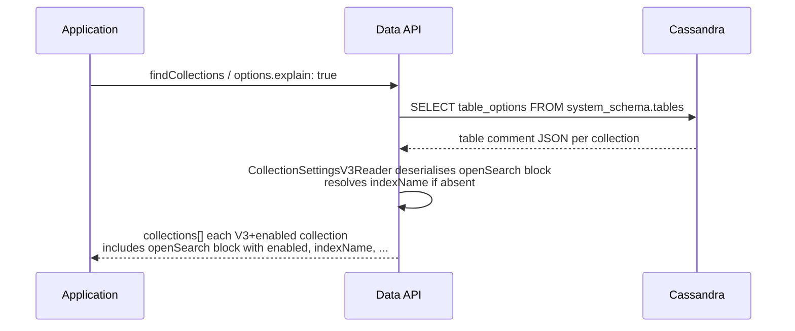

#### 4.2.3 OpenSearch fields in the Data API Payload

| Field | Always present | Omitted when | Notes |
|---|---|---|---|
| `enabled` | ✅ yes | Block absent entirely when `false` | Always `true` when the block is present. |
| `indexName` | ✅ yes | — | **Resolved OS index name** — never null. This is the OpenSearch index name (the `'indexName'` `WITH OPTIONS` value). The SAI index name (the Cassandra custom index identifier) is not returned here. |
| `numShards` | ✅ yes | — | Persisted at creation time; always returned. |
| `numReplicas` | ✅ yes | — | Persisted at creation time; always returned. |
| `mappings` | ✅ yes | — | The `mappings` object as provided at creation time; always persisted and always returned. |

#### 4.2.4 Sample payloads

**Request — `explain: true` is required to get the `openSearch` block:**
```json
{
  "findCollections": {
    "options": { "explain": true }
  }
}
```

---

**Response — articles collection with English analyzer:**
```json
{
  "status": {
    "collections": [
      {
        "name": "articles",
        "options": {
          "openSearch": {
            "enabled": true,
            "numShards": 1,
            "numReplicas": 1,
            "indexName": "articles-full-text",
            "mappings": {
              "title":       { "type": "text", "analyzer": "english" },
              "body":        { "type": "text", "analyzer": "english" },
              "author":      { "type": "keyword" },
              "publishedAt": { "type": "date" }
            }
          }
        }
      }
    ]
  }
}
```

> All fields are always round-tripped: `indexName`, `numShards`, `numReplicas`, and `mappings` are always present when `enabled: true`.

---

**Response — collection with `indexing.allow` (SAI) and separate `openSearch.mappings`:**
```json
{
  "status": {
    "collections": [
      {
        "name": "articles",
        "options": {
          "indexing": { "allow": ["category", "price", "publishedAt"] },
          "openSearch": {
            "enabled": true,
            "numShards": 1,
            "numReplicas": 1,
            "indexName": "articles-full-text",
            "mappings": {
              "title":  { "type": "text", "analyzer": "english" },
              "body":   { "type": "text", "analyzer": "english" },
              "author": { "type": "keyword" }
            }
          }
        }
      }
    ]
  }
}
```

> `indexing.allow` and `openSearch.mappings` are independent and both round-tripped as provided.

---

**Response — mixed list: one OpenSearch-enabled collection, two without:**
```json
{
  "status": {
    "collections": [
      {
        "name": "articles",
        "options": {
          "openSearch": {
            "enabled": true,
            "numShards": 1,
            "numReplicas": 1,
            "indexName": "hcd_my_app_articles",
            "mappings": {
              "abstract":        { "type": "text", "analyzer": "english" },
              "longDescription": { "type": "text" }
            }
          }
        }
      },
      {
        "name": "users",
        "options": {
          "indexing": { "deny": ["password_hash"] }
        }
      },
      {
        "name": "sessions",
        "options": {}
      }
    ]
  }
}
```

> `users` and `sessions` have no `openSearch` key — absence is the canonical signal that OpenSearch replication is not active.

---

**Response — `explain: false` (default) — `openSearch` block is never returned regardless of schema version:**
```json
{
  "status": {
    "collections": ["articles", "users", "sessions"]
  }
}
```

> Without `explain: true` the response is a flat name list. The `openSearch` block is never included in this form.

---

**Response — V1/V2 collection (no schema upgrade performed) — `openSearch` absent:**
```json
{
  "status": {
    "collections": [
      {
        "name": "legacy_docs",
        "options": {
          "vector": {
            "dimension": 1536,
            "metric": "cosine"
          }
        }
      }
    ]
  }
}
```

> A collection created before V3 has no `openSearch` node in its stored comment. `CollectionSettingsV3Reader` is not invoked; V1/V2 readers produce no `openSearch` field. Response is identical to today's `findCollections` behaviour.

#### 4.2.5 Implementation Tips (server)

**Behaviour rules**
- `findCollections` with `explain: true` includes an `openSearch` key whenever `CollectionSchemaVersion.V_3` is detected and `openSearch.enabled == true`.
- The returned object always contains: `enabled`, `numShards`, `numReplicas`, `indexName`, `mappings`. All are mandatory and always persisted at creation time.
- Collections with schema V1 or V2 return no `openSearch` field.
- A collection created with `openSearch.enabled: false` returns no `openSearch` field.
- Schema read-back: `CollectionSettingsV3Reader` must (1) read `schema.openSearch`; (2) if missing or `enabled == false` produce a disabled def; (3) if `enabled == true` populate all fields — if `indexName` is null in the stored comment, **throw `OPEN_SEARCH_CORRUPT_SCHEMA`** rather than silently recomputing the default. (4) omit the key entirely when `enabled == false`.

**Todo list**
1. Verify `CollectionSettingsV3Reader` stores `indexName`, `numShards`, `numReplicas`, and `mappings` as resolved values at write time.
2. Extend `ApiCollectionDescV3` to include the `openSearch` serialisation block, guarded by `openSearch.enabled == true`.
3. Add `openSearch` to the `CollectionOptions` response model serialised into the `findCollections` status payload.
4. All fields are always present — use `@JsonInclude(JsonInclude.Include.NON_NULL)` is not required. `numShards`, `numReplicas`, `indexName`, and `mappings` must never be null for an enabled index.
5. Unit tests: V3 full config round-trips; V3 `enabled: false` omits block; V2 omits block; `mappings` always present.

#### 4.2.6 Implementation Tips (clients)

> Client SDK documentation: [HCD API Reference — Instantiate Client](https://docs.datastax.com/en/hyper-converged-database/2.0/api-reference/instantiate-client.html) and sub-pages.

**Java**
```java
List<CollectionInfo> collections = database.listCollections(
        ListCollectionsOptions.builder().explain(true).build()
);
collections.forEach(info -> {
OpenSearchOptions os = info.getOptions().getOpenSearch();
    if (os != null) {
        System.out.println(info.getName() + " → " + os.getIndexName());
        System.out.println("  mappings: " + os.getMappings());
        }
        });
```

**Python**

> `list_collections()` — called without arguments — returns full `CollectionDefinition` instances (it is the explain-mode variant; `list_collection_names()` returns only names). The returned objects are class instances, not dictionaries: use attribute access (`.open_search.index_name`) rather than dictionary access (`["openSearch"]["indexName"]`). The `open_search` attribute is either `None` or an instance of `CollectionOpenSearchOptions`.

```python
from astrapy.info import CollectionDefinition, CollectionOpenSearchOptions

for col_def in database.list_collections():
    # col_def is a CollectionDefinition; col_def.open_search is None or CollectionOpenSearchOptions
    os_opts: CollectionOpenSearchOptions | None = col_def.open_search
    if os_opts is not None:
        print(f"{col_def.name} → {os_opts.index_name}")
        print(f"  mappings: {os_opts.mappings}")
```

**TypeScript / Node.js**
```typescript
const collections = await db.listCollections({ explain: true });
for (const col of collections) {
  if (col.options?.openSearch) {
    console.log(`${col.name} → ${col.options.openSearch.indexName}`);
    console.log(`  mappings: ${JSON.stringify(col.options.openSearch.mappings)}`);
  }
}
```

---

### 4.3 `createOpenSearchIndex` — new DDL command for Tables

#### 4.3.1 Goal

A new dedicated `createOpenSearchIndex` command is added for tables, following the same pattern as `createTextIndex` and `createVectorIndex` — one command per index type. Note: `createIndex` is a **sibling** command (for non-vector, non-analyzer SAI indexes), not a superclass or "generic" form of the others. All four commands sit at the same level.

> **SAI index name vs. OS index name for tables.** The two names are both user-configurable here, which makes the distinction especially important:
> - The **SAI index name** is the `name` field at the top level of the command (e.g. `"name": "articles_search"`). This becomes the Cassandra custom index identifier (`CREATE CUSTOM INDEX IF NOT EXISTS articles_search`) and is what is referenced in every subsequent `expr(articles_search, ...)` query. Users must choose this name and cannot change it after creation.
> - The **OS index name** is `definition.options.openSearchIndexName` (e.g. `"openSearchIndexName": "articles-full-text"`). This is the OpenSearch index name passed as `'indexName'` in `WITH OPTIONS`. It is optional — when omitted it defaults to `hcd_<keyspace>_<tableName>`. The field is named `openSearchIndexName` (not `indexName`) to avoid ambiguity with the SAI index name above.

Users also optionally list which columns to replicate (omitting the list replicates all non-primary-key columns) and can provide a `mappings` JSON object to override field types. Only one OpenSearch custom index per table is permitted by HCD.

After the index is created, the table's `find` command accepts the `$search` operator (see §4.5).

#### 4.3.2 How it works

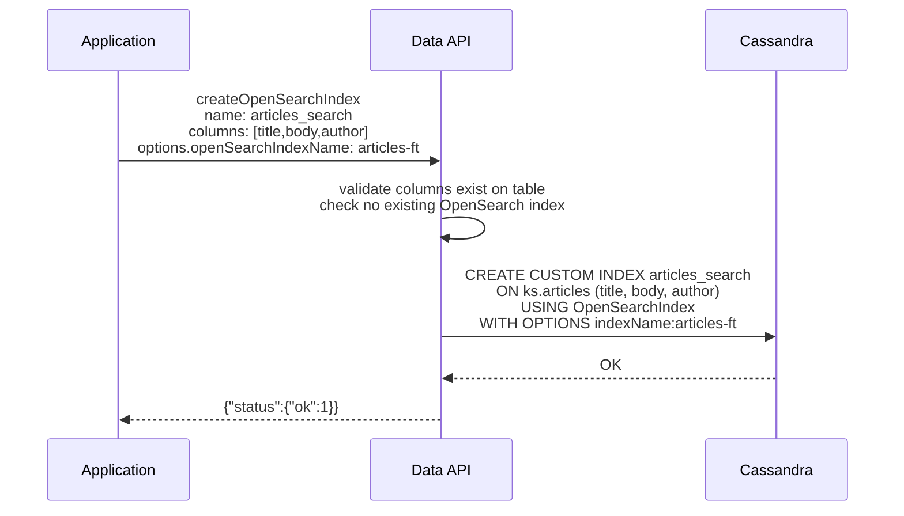

#### 4.3.3 OpenSearch fields in the Data API Payload

> **`mappings` is a real JSON object in the Data API payload.** The `definition.options.mappings` field accepts a JSON object (not a string). It is the flat field-name → OpenSearch mapping object — the same shape as `createCollection.openSearch.mappings`, but for tables HCD can infer the mapping from Cassandra column types so it is optional, and there is no `_id` injection. The Data API wraps it under `{"properties":{...}}` and serialises the result to a JSON string (`customMappingsJson`) before embedding it in the CQL `WITH OPTIONS` block. This wrapping and serialisation is a CQL/HCD constraint, not something the caller ever needs to handle.

> **`applyDefaultSchema` / `applyCustomSchema` — what they mean:** These are `WITH OPTIONS` flags consumed by the HCD connector. They control how HCD builds the OpenSearch field mapping:
> - `applyDefaultSchema: true` *(default for tables)* — HCD automatically derives the OS field mapping from the Cassandra column types. No `mappings` value is needed in the Data API payload; the table schema is the authority.
> - `applyDefaultSchema: false` — HCD ignores the Cassandra schema. Used in two situations: (a) when `definition.options.mappings` is supplied (the Data API then also sets `applyCustomSchema: true` and emits `customMappingsJson`), or (b) when `applyDefaultSchema: false` is set explicitly to rely on an existing OpenSearch index template with no mapping at all.
>
> For **collections** the Data API always uses `applyDefaultSchema: false` + `applyCustomSchema: true` + `customMappingsJson` because the Cassandra column is a single `doc_json TEXT` blob — the table schema carries no field-level type information.

| Field | Required | Default | Description |
|---|---|---|---|
| `name` | **yes** | — | **SAI index name** — the Cassandra custom index identifier. This name is used in `CREATE CUSTOM INDEX IF NOT EXISTS <name>` and in every subsequent `expr(<name>, ...)` query. Must be unique within the keyspace. Cannot be changed after creation. |
| `definition.columns` | no | *(all non-PK columns)* | List of table columns to replicate. Omit to replicate all non-primary-key columns. |
| `definition.options.numShards` | no | *(HCD default)* | Number of primary shards for the OS index. When omitted, HCD uses its own default. |
| `definition.options.numReplicas` | no | *(HCD default)* | Number of replicas for the OS index (analogous to Cassandra replication factor). When omitted, HCD uses its own default. |
| `definition.options.openSearchIndexName` | no | `hcd_<keyspace>_<tableName>` | **OS index name** — the OpenSearch index name (passed as `'indexName'` in `WITH OPTIONS`). Independent of the SAI index name above. Auto-generated when absent. Renamed from `indexName` to avoid ambiguity with the SAI index name (see §1 terminology box). |
| `definition.options.mappings` | no | *(HCD infers from Cassandra schema)* | Flat field-name → OpenSearch field definition map as a **real JSON object** (not a string). For tables, HCD can derive the mapping automatically from the Cassandra column types (`applyDefaultSchema: 'true'`). Provide only when you need specific analyzers or types the default schema would not produce. The Data API wraps it under `{"properties":{...}}` and serialises the result to a JSON string for the CQL `WITH OPTIONS` `customMappingsJson` key — the caller never deals with the wrapping or serialisation. |
| `options.ifNotExists` | no | `false` | Do not error if a Cassandra custom index with this SAI index name already exists. |

#### 4.3.4 Sample payloads

**Minimal — index all non-PK columns with HCD default mapping (no shard/partition count needed):**
```json
{
  "createOpenSearchIndex": {
    "name": "users_search"
  }
}
```
→ CQL emitted:
```cql
-- SAI index name: users_search          (Cassandra identifier, used in expr())
-- OS index name:  hcd_mykeyspace_users  (OpenSearch index — defaults to hcd_<ks>_<table> when 'indexName' is absent)
CREATE CUSTOM INDEX IF NOT EXISTS users_search
ON mykeyspace.users ()
USING 'OpenSearchIndex'
WITH OPTIONS = {
  'createIndexIfNotExists': 'true'
};
```

---

**Specific columns, default HCD mapping derived from schema:**
```json
{
  "createOpenSearchIndex": {
    "name": "articles_search",
    "definition": {
      "columns": ["title", "body", "tags", "author"]
    },
    "options": {
      "ifNotExists": true
    }
  }
}
```
→ CQL emitted:
```cql
-- SAI index name: articles_search            (Cassandra identifier, used in expr())
-- OS index name:  hcd_mykeyspace_articles    (OpenSearch index — defaulted)
CREATE CUSTOM INDEX IF NOT EXISTS articles_search
ON mykeyspace.articles (title, body, tags, author)
USING 'OpenSearchIndex'
WITH OPTIONS = {
  'createIndexIfNotExists': 'true'
};
```

---

**Specific columns with custom OpenSearch field mappings:**
```json
{
  "createOpenSearchIndex": {
    "name": "articles_search",
    "definition": {
      "columns": ["title", "body", "author", "published_at"],
      "options": {
        "openSearchIndexName": "articles-full-text",
        "mappings": {
          "title":        { "type": "text", "analyzer": "english" },
          "body":         { "type": "text", "analyzer": "english" },
          "author":       { "type": "keyword" },
          "published_at": { "type": "date", "format": "strict_date_optional_time" }
        }
      }
    },
    "options": {
      "ifNotExists": true
    }
  }
}
```
→ CQL emitted (the Data API wraps `mappings` under `{"properties":{...}}` and serialises to a JSON string before embedding it in `WITH OPTIONS`):
```cql
-- SAI index name: articles_search   (Cassandra identifier, used in expr())
-- OS index name:  articles-full-text (OpenSearch index, set explicitly via definition.options.openSearchIndexName)
CREATE CUSTOM INDEX IF NOT EXISTS articles_search
ON mykeyspace.articles (title, body, author, published_at)
USING 'OpenSearchIndex'
WITH OPTIONS = {
  'createIndexIfNotExists': 'true',
  'indexName':              'articles-full-text',
  'applyCustomSchema':      'true',
  'applyDefaultSchema':     'false',
  'customMappingsJson':     '{"properties":{"title":{"type":"text","analyzer":"english"},"body":{"type":"text","analyzer":"english"},"author":{"type":"keyword"},"published_at":{"type":"date","format":"strict_date_optional_time"}}}'
};
```

---

**Using `applyDefaultSchema: false` to rely on an OpenSearch index template:**
```json
{
  "createOpenSearchIndex": {
    "name": "events_search",
    "definition": {
      "columns": ["event_type", "payload", "region"],
      "options": {
        "openSearchIndexName": "events-search",
        "applyDefaultSchema": false
      }
    }
  }
}
```

---

**`listIndexes` response showing an OpenSearch index alongside SAI indexes:**
```json
{
  "listIndexes": {}
}
```
Response:
```json
{
  "status": {
    "indexes": [
      {
        "name": "articles_title_sai",
        "indexType": "regular",
        "definition": {
          "column": "title"
        }
      },
      {
        "name": "articles_search",
        "indexType": "openSearch",
        "definition": {
          "columns": ["title", "body", "author", "published_at"],
          "options": {
            "openSearchIndexName": "articles-full-text",
            "applyDefaultSchema": false
          }
        }
      }
    ]
  }
}
```

> In this response: `"name": "articles_search"` is the **SAI index name** (Cassandra custom index identifier, used in `expr(articles_search, ...)`). `"definition.options.openSearchIndexName": "articles-full-text"` is the **OS index name** (the OpenSearch index). These two names are independent and serve different purposes.

#### 4.3.5 Implementation Tips (server)

**Behaviour rules**
- `createOpenSearchIndex` is a dedicated command registered alongside `createTextIndex` and `createVectorIndex` — not an extension of the generic `createIndex` command.
- The `definition.columns` list is optional. When absent, the CQL `ON table ()` form is emitted (empty column list) and HCD replicates all non-primary-key columns.
- After creation, `listIndexes` returns the new index with `indexType: "openSearch"`, serialised via `ApiOpenSearchIndex.getSchemaDescription()`. The entry exposes both the **SAI index name** (from `name`) and the **OS index name** (from `definition.options.openSearchIndexName`, resolved).
- Only one OpenSearch custom index (SAI index name) is permitted per table. The resolver must call `schemaObject.apiTableDef().indexes()` and reject with `OPEN_SEARCH_INDEX_ALREADY_EXISTS` if any index of type `OPEN_SEARCH` already exists.
- `options.ifNotExists` maps to `IF NOT EXISTS` in the CQL `CREATE CUSTOM INDEX` statement (guards the SAI index name), consistent with `createTextIndex` behaviour.

**CQL emitted**

`CreateIndexDBTask.buildStatement()` currently hard-codes `CQLSAIIndex.SAI_CLASS_NAME` (`StorageAttachedIndex`) as the custom index class. For OpenSearch indexes the class must be `OpenSearchIndex` instead. The fix is to read the class name from `ApiIndexDef` rather than hard-coding it. `ApiOpenSearchIndex` will expose `OPEN_SEARCH_CLASS_NAME = "OpenSearchIndex"` and override `indexClassName()` accordingly.

**`WITH OPTIONS` mapping rules** (for `createOpenSearchIndex`)

> The SAI index name appears in the `CREATE CUSTOM INDEX IF NOT EXISTS <sai-index-name>` statement itself, not inside `WITH OPTIONS`. The OS index name is the only `WITH OPTIONS` key that controls the OpenSearch-side index identity.

| Condition | Option key added |
|---|---|
| Always | `createIndexIfNotExists: 'true'` |
| `definition.options.numShards` set by user | `numShards: '<value>'` |
| `definition.options.numReplicas` set by user | `numReplicas: '<value>'` |
| `definition.options.openSearchIndexName` set by user (OS index name) | `indexName: '<value>'` |
| `definition.options.mappings` set | `applyCustomSchema: 'true'`, `applyDefaultSchema: 'false'`, `customMappingsJson: '<serialised-json>'` (the Data API wraps `mappings` under `{"properties":{...}}` and serialises to a JSON string) |
| `definition.options.applyDefaultSchema: false` | `applyDefaultSchema: 'false'` |

> Unlike the collection path, `unpackJsonFields` is **not** set here — tables have typed columns so HCD does not need to unpack a JSON blob.

**Todo list**
1. Create `CreateOpenSearchIndexCommand` record in `api/model/command/impl` mirroring `CreateTextIndexCommand` — fields: `String name`, `OpenSearchIndexDefinitionDesc definition`, `String indexType`, `CommandOptions options`.
2. Create `OpenSearchIndexDefinitionDesc` record in `api/model/command/table/definition/indexes` — fields: `List<String> columns`, `OpenSearchIndexOptions options` (inner record: `numShards`, `numReplicas`, `openSearchIndexName`, `JsonNode mappings`, `applyDefaultSchema`).
3. Add `OPEN_SEARCH("openSearch")` to [`ApiIndexType`](src/main/java/io/stargate/sgv2/jsonapi/service/schema/tables/ApiIndexType.java) enum, and add `OPEN_SEARCH_CLASS_NAME = "OpenSearchIndex"` constant.
4. Update [`IndexFactoryFromCql.isSupported()`](src/main/java/io/stargate/sgv2/jsonapi/service/schema/tables/factories/IndexFactoryFromCql.java) to return `true` for both SAI indexes and OpenSearch indexes: `CQLSAIIndex.isSAIIndex(indexMetadata) || isOpenSearchIndex(indexMetadata)` where `isOpenSearchIndex` checks `class_name == "OpenSearchIndex"`.
5. Create `ApiOpenSearchIndex` class in `service/schema/tables` following `ApiTextIndex` — includes `FROM_DESC_FACTORY` (`UserDescFactory` creates from `OpenSearchIndexDefinitionDesc`) and `FROM_CQL_FACTORY` (creates from `IndexMetadata` when `class_name` is `OpenSearchIndex`).
6. Update [`IndexFactoryFromCql.create()`](src/main/java/io/stargate/sgv2/jsonapi/service/schema/tables/factories/IndexFactoryFromCql.java) switch to handle the `OPEN_SEARCH` case by delegating to `ApiOpenSearchIndex.FROM_CQL_FACTORY`.
7. Update [`CreateIndexDBTask.buildStatement()`](src/main/java/io/stargate/sgv2/jsonapi/service/operation/tables/CreateIndexDBTask.java) to read the custom index class name from `ApiIndexDef` rather than hard-coding `SAI_CLASS_NAME` — add `indexClassName()` method to `ApiIndexDef` base class with default `SAI_CLASS_NAME`, overridden to `OPEN_SEARCH_CLASS_NAME` in `ApiOpenSearchIndex`.
8. Create `CreateOpenSearchIndexCommandResolver` in `service/resolver` following `CreateTextIndexCommandResolver` — validates no duplicate OpenSearch index; resolves the OS index name default (`hcd_<keyspace>_<tableName>` when `definition.options.openSearchIndexName` is absent); when `mappings` is provided, wraps it under `{"properties":{...}}` and serialises to a JSON string for `customMappingsJson`; builds `ApiOpenSearchIndex` via `FROM_DESC_FACTORY`; hands off to `CreateIndexDBTaskBuilder`. The SAI index name is taken directly from `command.name`.
9. Register the command in the command router alongside other index creation commands.
10. Update `listIndexes` serialisation to include `openSearch` index type in the index type enum accepted by the list response serialiser.

**Relevant context**
- Pattern command: [`CreateTextIndexCommand`](src/main/java/io/stargate/sgv2/jsonapi/api/model/command/impl/CreateTextIndexCommand.java)
- Pattern resolver: [`CreateTextIndexCommandResolver`](src/main/java/io/stargate/sgv2/jsonapi/service/resolver/CreateTextIndexCommandResolver.java)
- Pattern model: [`ApiTextIndex`](src/main/java/io/stargate/sgv2/jsonapi/service/schema/tables/ApiTextIndex.java)
- Index task: [`CreateIndexDBTask`](src/main/java/io/stargate/sgv2/jsonapi/service/operation/tables/CreateIndexDBTask.java) — `buildStatement()` to be updated
- Type enum: [`ApiIndexType`](src/main/java/io/stargate/sgv2/jsonapi/service/schema/tables/ApiIndexType.java) — add `OPEN_SEARCH`
- Factory: [`IndexFactoryFromCql`](src/main/java/io/stargate/sgv2/jsonapi/service/schema/tables/factories/IndexFactoryFromCql.java) — `isSupported()` and `create()` both require changes

#### 4.3.6 Implementation Tips (clients)

> Client SDK documentation: [HCD API Reference — Instantiate Client](https://docs.datastax.com/en/hyper-converged-database/2.0/api-reference/instantiate-client.html) and sub-pages.

**Java**
```java
database.getTable("articles").createOpenSearchIndex(
    "articles_search",
    OpenSearchIndexDefinition.builder()
        .columns("title", "body", "author", "published_at")
        .openSearchIndexName("articles-full-text")
        .mappings(
        OpenSearchMappings.builder()
                .field("title", "text", "english")
                .build()
        )
                .build(),
    CreateOpenSearchIndexOptions.builder()
        .ifNotExists(true)
        .build()
);
```

**Python**

> Use named classes for `OpenSearchIndexDefinition` rather than raw dictionaries when available. The `mappings` field is a real JSON-compatible object (not a serialised string).

```python
from astrapy.info import OpenSearchIndexDefinition, OpenSearchIndexOptions

table = database.get_table("articles")
table.create_open_search_index(
    "articles_search",
    definition=OpenSearchIndexDefinition(
        columns=["title", "body", "author", "published_at"],
        options=OpenSearchIndexOptions(
            open_search_index_name="articles-full-text",
            mappings={
                "title":  {"type": "text", "analyzer": "english"},
            },
        ),
    ),
    if_not_exists=True,
)
```

**TypeScript / Node.js**
```typescript
const table = db.table("articles");
await table.createOpenSearchIndex("articles_search", {
  definition: {
    columns: ["title", "body", "author", "published_at"],
    options: {
      openSearchIndexName: "articles-full-text",
      mappings: {
        title: { type: "text", analyzer: "english" }
      }
    }
  },
  options: { ifNotExists: true }
});
```

---

### 4.4 `find` on Collections — new `$search` filter operator

#### 4.4.1 Goal

Collections created with `openSearch.enabled: true` gain a new `$search` filter operator. The value is an OpenSearch query DSL object — the full expressive power of OpenSearch queries (match, bool, range, term, multi_match, etc.) is available. The Data API routes the query to Cassandra's `expr(...)` predicate which delegates to the HCD OpenSearch query handler; no change is required on the client beyond using the new filter key.

> **Scope:** While this section focuses on `find`, the `$search` filter operator applies to **all commands that accept a filter** — including `findOne`, `findOneAndUpdate`, `findOneAndReplace`, `findOneAndDelete`, `updateOne`, `updateMany`, `deleteOne`, `deleteMany`, and `countDocuments`. The same rules apply everywhere: `$search` must be the sole filter key, and the collection must have been created with `openSearch.enabled: true`.

`$search` must be the only key in the filter — it cannot be combined with other operators in the same request. `projection` works normally.

**Default result order is OpenSearch relevance.** When no `sort` clause is provided, documents are returned in the order OpenSearch produces them — descending by relevance score. This is the natural and expected behaviour of a `$search` query. Adding a `sort` clause overrides this ordering with an in-memory sort on document fields (see §4.4.2), which discards the relevance ranking.

**Paging — three strategies.** Because the `$search` value is passed verbatim to `expr(...)`, the full OpenSearch pagination DSL is available directly inside the filter. This unlocks stable, deep paging that is not possible with the standard Cassandra `pageState` approach.

> **`size` in the DSL is the correct result-count bound for OpenSearch queries.** Pass `"size": N` inside the `$search` value to tell OpenSearch how many hits to return. **Do NOT set `options.limit` alongside a DSL `size`** — HCD's query handler rejects a CQL `LIMIT` combined with a `size` in the `expr(...)` envelope with an explicit error, because the two bound different things (hits fetched vs rows returned). Use `options.limit` only with `pageState`-based paging, where there is no DSL `size`.

| Strategy | How it works | Stable across writes? | Max results | Use when |
|---|---|---|---|---|
| **`from` / `size`** | Pass `from` and `size` inside the `$search` DSL. OpenSearch returns that window of hits. **Do not set `options.limit`.** | ⚠️ No — new writes can shift pages | 10 000 total | Simple shallow paging; UI where exact consistency is not critical |
| **`search_after`** | Sort by a tiebreaker field; pass the last hit's sort values as `search_after` in the next request. Use `size` inside the DSL to set page size. **Do not set `options.limit`.** | ⚠️ Soft — live index, but no duplicates if sort key is unique | Unlimited | Deep paging with a unique sort key (e.g. document `_id`) |
| **PIT + `search_after`** | Open a Point-in-Time snapshot; all pages query the frozen dataset. | ✅ Yes — dataset frozen at PIT creation | Unlimited | Deep paging where consistency across pages is required |
| **Cassandra `pageState`** | Standard Data API paging token driven by Cassandra's row cursor. Set `options.limit` to control page size. Do not set DSL `size`. | ⚠️ Soft — HCD re-runs OS query per CQL page | 10 000 total | Simple relevance-ordered paging; no `sort` needed |

> **`pageState` + `$search`** still works and is the simplest approach for relevance-ordered paging. For paging + field sort, or for deep paging beyond 10 000 results, use `from`/`size` or `search_after` inside the DSL instead.

#### 4.4.2 How it works

`$search` is one of four search-path operators a collection can expose. They are **mutually exclusive per query** — each one takes over the full CQL routing for that request and cannot share a `filter` object with the others or with standard field predicates.

| Operator | Requires at creation | Routed via | Can combine with `sort`? | Can combine with rerank? |
|---|---|---|---|---|
| `$match` | `lexical.enabled: true` | SAI text index | Yes (CQL `ORDER BY`) | Yes — rerank re-scores `$match` results |
| `$vector` | `vector` block | ANN index | No | Yes — rerank re-scores ANN results |
| `$hybrid` | `vector` + `lexical` | ANN + SAI fused | No | Yes — rerank re-scores fused results |
| `$search` | `openSearch.enabled: true` | `expr(...)` → OpenSearch | Yes — two kinds (see below) | No — not supported in this version |

**Rerank and `$search`:** rerank is currently not supported in combination with `$search`. The rerank pipeline expects a candidate set produced by the Data API's internal ANN or lexical paths; the `expr(...)` result set is owned by OpenSearch and returned as already-ranked rows by relevance score. A future version could pipe `$search` results through rerank, but that is out of scope here.

**`$search` + `sort` — two distinct meanings:** There are two ways to sort with `$search`, and they are very different:
1. **Sort inside the `$search` DSL** (e.g. `$search: { "sort": [...], "query": {...} }`) — this sort is passed verbatim to OpenSearch and executed server-side. OpenSearch applies it before returning hits. This is the recommended way to order results when using `$search`.
2. **Data API `sort` clause alongside `$search`** (e.g. `find: { filter: {$search: ...}, sort: {field: 1} }`) — this is a **post-fetch, in-memory** sort applied by the Data API after OpenSearch has already returned results. It does **not** influence the OpenSearch query, and it discards the OpenSearch relevance ranking. Use this only when you need to sort on a field that is not in the OpenSearch index.

**Sequence diagram — request flow:**

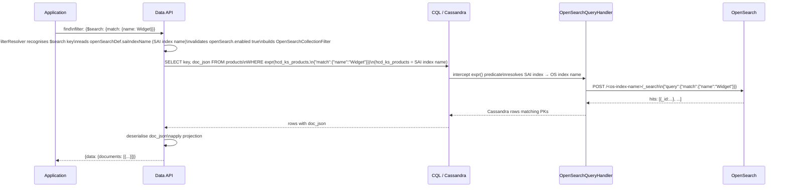

#### 4.4.3 OpenSearch fields in the Data API Payload

The `$search` filter value is an **OpenSearch Query DSL** object. It is serialised to JSON and passed into the CQL `expr(<saiIndexName>, '<dsl>')` predicate. The Data API passes the DSL through with **one exception**: any `_id` value inside a `term`, `terms`, or `ids` query clause is rewritten from the Data API string form to the HCD composite-key encoding before the `expr(...)` is assembled (see the `_id` rewriting callout below).

| Filter field | Type | Description |
|---|---|---|
| `$search` | Object | Root key — must be the **only** key in the `filter` object. Its value is any valid OpenSearch query clause. |
| `$search.<queryType>` | Object | Any OpenSearch leaf or compound query: `match`, `multi_match`, `match_phrase`, `bool`, `term`, `range`, `wildcard`, `fuzzy`, `match_all`, etc. |

> **Same field in `$search` and an outer filter?** This is structurally impossible — `$search` must be the only key in the filter object, so there is no outer filter to conflict with. If you need to filter on a field that also appears in an OpenSearch query, put both conditions inside the `bool` query within the `$search` value (e.g. `"bool": {"must": [...], "filter": [...]}`).

> **`_id` rewriting — `term`, `terms`, and `ids` queries.** The Data API `_id` field (e.g. `"product-3"`) is intentionally excluded from the OpenSearch `_source` (it is not in `propertiesFromJsonFields`) because OpenSearch permanently rejects `_id` as a body field. Instead, OpenSearch's reserved metadata `_id` carries the **Cassandra composite primary-key encoding** that HCD sets at index time: `{_0=<partitionKey>, _1=<clusteringKey>}`. For a collection with a single-value `_id` of `"product-3"`, the Cassandra PK is `(partition=1, clustering=product-3)`, so the OS `_id` is the string `{_0=1, _1=product-3}`. A plain `{"term": {"_id": "product-3"}}` query therefore **never matches** — the user-visible `_id` and the OS metadata `_id` are different strings.
>
> To bridge this gap, the Data API **rewrites `_id` values** in the DSL before serialising the `expr(...)` predicate:
> - **`term` on `_id`:** `{"term": {"_id": "product-3"}}` → `{"term": {"_id": "{_0=1, _1=product-3}"}}`
> - **`terms` on `_id`:** `{"terms": {"_id": ["product-2", "product-3"]}}` → `{"terms": {"_id": ["{_0=1, _1=product-2}", "{_0=1, _1=product-3}"]}}`
> - **`ids` query:** `{"ids": {"values": ["product-2", "product-3"]}}` → `{"ids": {"values": ["{_0=1, _1=product-2}", "{_0=1, _1=product-3}"]}}`
>
> The rewriting applies recursively when these clauses appear inside a `bool` query (`must`, `should`, `must_not`, `filter` arrays). All other query types (`match`, `range`, `wildcard`, etc.) are passed through unchanged.
>
> **`search_after` cursor with `_id` tiebreaker:** when a client sorts by `_id` inside the DSL and uses `search_after` for deep paging, the cursor value returned by OpenSearch is already in the HCD encoding (`{_0=1, _1=product-3}`). The client must pass this opaque string back verbatim as the `search_after` value — no rewriting is needed or applied.

**Supported OpenSearch query types (non-exhaustive)**

| Query type | Use case |
|---|---|
| `match` | Full-text search on a single field with analysis |
| `multi_match` | Full-text search across multiple fields |
| `match_phrase` | Exact phrase match |
| `bool` | Compound queries with `must`, `should`, `must_not`, `filter` clauses |
| `term` | Exact value match (no analysis, for keyword fields) |
| `range` | Numeric or date range filtering |
| `wildcard` | Prefix / glob pattern matching |
| `fuzzy` | Approximate match with edit distance |
| `match_all` | Returns all indexed documents |

#### 4.4.4 Sample payloads

**Simple term match — find all products whose `name` contains "Widget":**
```json
{
  "find": {
    "filter": {
      "$search": {
        "match": { "name": "Widget" }
      }
    }
  }
}
```

---

**Paging — strategy 1: Cassandra `pageState` (simplest, relevance order, ≤10 000 total results)**

Page 1 — no `pageState`:
```json
{
  "find": {
    "filter": {
      "$search": {
        "match": { "description": "high performance cassandra database" }
      }
    },
    "options": { "limit": 20 }
  }
}
```
Response carries `"nextPageState": "<token>"`. Pass it back for page 2:
```json
{
  "find": {
    "filter": {
      "$search": {
        "match": { "description": "high performance cassandra database" }
      }
    },
    "options": { "limit": 20, "pageState": "<token from page 1>" }
  }
}
```
> Results are returned in OpenSearch relevance order. HCD re-runs the OpenSearch query on each CQL page request, so results may shift if documents are written between pages. Capped at 10 000 total hits.

---

**Paging — strategy 2: `from` / `size` inside the DSL (offset paging, up to 10 000)**

Page 1 — `from: 0, size: 20`:
```json
{
  "find": {
    "filter": {
      "$search": {
        "from": 0,
        "size": 20,
        "query": {
          "match": { "description": "high performance cassandra database" }
        }
      }
    }
  }
}
```
Page 2 — `from: 20, size: 20`:
```json
{
  "find": {
    "filter": {
      "$search": {
        "from": 20,
        "size": 20,
        "query": {
          "match": { "description": "high performance cassandra database" }
        }
      }
    }
  }
}
```
> The `from`/`size` window is resolved entirely inside OpenSearch before the PKs reach Cassandra. No Data API `pageState` is needed — the client tracks the offset. OpenSearch limits this to 10 000 total results; use `search_after` for deeper paging.

---

**Paging — strategy 3: `search_after` (deep paging, unlimited, requires a sort tiebreaker)**

Page 1 — initial query with a deterministic `sort`:
```json
{
  "find": {
    "filter": {
      "$search": {
        "size": 20,
        "query": {
          "match": { "description": "cassandra database" }
        },
        "sort": [
          { "_score": { "order": "desc" } },
          { "_id":    { "order": "asc"  } }
        ]
      }
    }
  }
}
```
The last document in the response will have sort values like `[0.87, "{_0=1, _1=doc-abc123}"]`. The `_id` tiebreaker is the HCD composite-key encoding — pass it back verbatim as the `search_after` value, no rewriting required:
```json
{
  "find": {
    "filter": {
      "$search": {
        "size": 20,
        "query": {
          "match": { "description": "cassandra database" }
        },
        "sort": [
          { "_score": { "order": "desc" } },
          { "_id":    { "order": "asc"  } }
        ],
        "search_after": [0.87, "{_0=1, _1=doc-abc123}"]
      }
    }
  }
}
```
> `search_after` is a live cursor — it works on the current state of the index, so new documents written between requests can appear on subsequent pages. Adding `_id` as the final tiebreaker ensures no duplicates even if scores are equal. No 10 000 cap applies. The sort lives **inside** the OpenSearch DSL; it is not the Data API `sort` clause and does not trigger in-memory sorting. The `_id` cursor value (`{_0=1, _1=doc-abc123}`) is in the HCD composite-key encoding returned by OpenSearch — pass it back verbatim; the Data API does not rewrite `search_after` values.

---

**Multi-field match — search across multiple document fields:**
```json
{
  "find": {
    "filter": {
      "$search": {
        "multi_match": {
          "query": "machine learning tutorial",
          "fields": ["title", "body", "tags"]
        }
      }
    }
  }
}
```

---

**Boolean query — must match + range filter:**
```json
{
  "find": {
    "filter": {
      "$search": {
        "bool": {
          "must": [
            { "match": { "description": "cassandra database" } }
          ],
          "filter": [
            { "range": { "price": { "gte": 5.0, "lte": 100.0 } } },
            { "term": { "category": "database" } }
          ]
        }
      }
    },
    "options": { "limit": 10 }
  }
}
```

---

**Match all — retrieve all indexed documents (useful for testing/debugging):**
```json
{
  "find": {
    "filter": {
      "$search": { "match_all": {} }
    }
  }
}
```

---

**Phrase match — exact phrase in a field:**
```json
{
  "find": {
    "filter": {
      "$search": {
        "match_phrase": { "body": "distributed database cluster" }
      }
    },
    "projection": { "title": 1, "author": 1, "publishedAt": 1 }
  }
}
```

---

**Wildcard / prefix search:**
```json
{
  "find": {
    "filter": {
      "$search": {
        "wildcard": { "title": "data*" }
      }
    }
  }
}
```

---

**Combined with `findOne`:**
```json
{
  "findOne": {
    "filter": {
      "$search": {
        "term": { "author": "Alice Smith" }
      }
    }
  }
}
```

---

**Combined with `findOneAndUpdate` — update the first matching OpenSearch result:**
```json
{
  "findOneAndUpdate": {
    "filter": {
      "$search": {
        "match": { "title": "Getting Started" }
      }
    },
    "update": {
      "$set": { "status": "published" }
    }
  }
}
```

---

**k-NN vector search via OpenSearch — pass-through for advanced users who configure a `knn_vector` mapping:**
```json
{
  "find": {
    "filter": {
      "$search": {
        "knn": {
          "embedding": {
            "vector": [0.12, 0.85, 0.34, 0.67],
            "k": 10
          }
        }
      }
    }
  }
}
```
> **Prerequisite:** the collection's OpenSearch index must declare the `embedding` field with `"type": "knn_vector"` in its `mappings`. Provide this at collection creation via `openSearch.mappings`:
> ```json
> "mappings": { "embedding": { "type": "knn_vector", "dimension": 4 } }
> ```
> This is an advanced pattern for users who want OpenSearch-backed **KNN** (k-nearest-neighbour) search. Note the difference from the Data API's native `$vector` operator: `$vector` uses SAI's **ANN** (approximate nearest-neighbour) index which is orders of magnitude faster than exact KNN. OpenSearch `knn_vector` performs **exact KNN** — results are more precise but at a significant performance cost at scale. For most vector search use cases, the Data API's native `$vector` operator is the recommended path.

---

**`neural` sparse vector query — for OpenSearch neural-sparse models:**
```json
{
  "find": {
    "filter": {
      "$search": {
        "neural_sparse": {
          "passage_embedding": {
            "query_text": "distributed cassandra database",
            "model_id": "aB3dEfGh"
          }
        }
      }
    }
  }
}
```
> **Prerequisite:** the OpenSearch index must have a `rank_features` (sparse) field declared in `mappings` and the neural-sparse model must be deployed in the OpenSearch cluster. Pass the model ID at query time. Like `knn`, this is a pass-through advanced pattern with no Data API validation of the DSL payload.

---

**`neural` dense vector query — model-backed dense embedding lookup:**
```json
{
  "find": {
    "filter": {
      "$search": {
        "neural": {
          "passage_embedding": {
            "query_text": "real-time analytics with Cassandra",
            "model_id": "aB3dEfGh",
            "k": 5
          }
        }
      }
    }
  }
}
```

---

**Error case — `$search` combined with another filter operator:**
```json
{
  "find": {
    "filter": {
      "$search": { "match": { "title": "tutorial" } },
      "status": { "$eq": "published" }
    }
  }
}
```
Response:
```json
{
  "errors": [{
    "message": "$search cannot be combined with other filter operators. The $search filter must be the only condition in the filter object.",
    "errorCode": "INVALID_OPEN_SEARCH_FILTER"
  }]
}
```

---

**`_id` filter — `term` on `_id` (Data API `_id` is rewritten to HCD composite-key encoding):**
```json
{
  "find": {
    "filter": {
      "$search": {
        "term": { "_id": "product-3" }
      }
    }
  }
}
```
> The Data API rewrites this to `{"term": {"_id": "{_0=1, _1=product-3}"}}` before serialising the `expr(...)` predicate. The user always writes the plain Data API `_id` string; the encoding to the HCD composite-key format happens transparently server-side.

---

**`_id` filter — `ids` query for multiple documents (all values rewritten):**
```json
{
  "find": {
    "filter": {
      "$search": {
        "ids": { "values": ["product-2", "product-3", "product-5"] }
      }
    }
  }
}
```
> Rewritten to `{"ids": {"values": ["{_0=1, _1=product-2}", "{_0=1, _1=product-3}", "{_0=1, _1=product-5}"]}}` before the `expr(...)` is assembled.

---

**`_id` filter inside `bool` — combined with full-text search:**
```json
{
  "find": {
    "filter": {
      "$search": {
        "bool": {
          "must": [
            { "match": { "status": "pending" } }
          ],
          "filter": [
            { "terms": { "_id": ["product-2", "product-3"] } }
          ]
        }
      }
    }
  }
}
```
> The `terms` clause inside `bool.filter` is rewritten recursively: `{"terms": {"_id": ["{_0=1, _1=product-2}", "{_0=1, _1=product-3}"]}}`. The `match` clause is unchanged.

---

**Error case — `$search` on a collection without OpenSearch enabled:**
```json
{
  "find": {
    "filter": {
      "$search": { "match": { "name": "Widget" } }
    }
  }
}
```
Response:
```json
{
  "errors": [{
    "message": "The collection 'products' does not have an OpenSearch index. Enable openSearch at collection creation time to use the $search filter.",
    "errorCode": "OPEN_SEARCH_NOT_ENABLED"
  }]
}
```

#### 4.4.5 Implementation Tips (server)

**Behaviour rules**
- `$search` is detected in [`CollectionFilterResolver`](src/main/java/io/stargate/sgv2/jsonapi/service/resolver/matcher/CollectionFilterResolver.java) when the filter object has `"$search"` as its sole key. Detection must happen **before** the standard filter capture group matching, because `$search`'s value is an arbitrary JSON object — not a primitive or a document-level comparison — and the existing match rules cannot handle it.
- When `$search` is detected, the resolver first checks `collectionSchemaObject.openSearchDef().enabled()`. If `false` (or no OpenSearch def), throw `OPEN_SEARCH_NOT_ENABLED`.
- If any other key coexists with `"$search"` in the filter object, throw `INVALID_OPEN_SEARCH_FILTER` before any index lookup.
- The `$search` DSL JSON node is **rewritten** before serialisation (see the `_id` rewriting step below) and then serialised into `expr(<saiIndexName>, '<dsl>')`. Here `<saiIndexName>` is the **SAI index name** — the Cassandra custom index identifier stored in `collectionOpenSearchDef.saiIndexName` (auto-generated as `hcd_<keyspace>_<collectionName>`).
- A new `OpenSearchCollectionFilter` class is created (following [`MatchCollectionFilter`](src/main/java/io/stargate/sgv2/jsonapi/service/operation/filters/collection/MatchCollectionFilter.java)). Its `get()` method returns a `BuiltCondition` using a new `BuiltConditionPredicate.EXPR` predicate that renders as `expr(<saiIndexName>, '<dslJson>')`.
- [`FindCollectionOperation`](src/main/java/io/stargate/sgv2/jsonapi/service/operation/collections/FindCollectionOperation.java) does not need structural changes — `OpenSearchCollectionFilter` is added to the `DBLogicalExpression` like any other collection filter. The `EXPR` predicate handles the CQL generation.
- `sort` is allowed alongside `$search` — the in-memory sort pipeline in `FindCollectionOperation` continues to operate after results are fetched from Cassandra, discarding OpenSearch's relevance ordering.
- Rerank must be explicitly blocked at the `findAndRerank` command level — see the "`findAndRerank` — `$search` must be blocked at the outer command level" note below. For plain `find` with `$search`, rerank is never triggered because the `$search` branch in `FindCommandResolver` does not enter the rerank pipeline.

**`_id` DSL rewriting**

The Data API `_id` field is excluded from the OpenSearch `_source` (it is not in `propertiesFromJsonFields`) because OpenSearch permanently rejects `_id` as a body field. OpenSearch's reserved metadata `_id` instead holds the Cassandra composite primary-key encoding that HCD sets at index time: the string `{_0=<partitionKey>, _1=<clusteringKey>}`. A user writing `{"term": {"_id": "product-3"}}` in their `$search` DSL would never get a match — the OS `_id` for that document is `{_0=1, _1=product-3}`.

To fix this transparently, a new `OpenSearchDslIdRewriter` (or equivalent utility method on `OpenSearchCollectionFilter`) performs a recursive walk of the DSL `JsonNode` before it is serialised, applying the following rewrites:

| Clause found | Rewriting rule |
|---|---|
| `{"term": {"_id": "<value>"}}` | Replace string value with `OpenSearchIdEncoder.encode("<value>")` → `"{_0=1, _1=<value>}"` |
| `{"terms": {"_id": ["<v1>", "<v2>", ...]}}` | Replace each string element with the encoded form |
| `{"ids": {"values": ["<v1>", "<v2>", ...]}}` | Replace each string element with the encoded form |
| Any of the above nested inside `bool.must`, `bool.should`, `bool.must_not`, `bool.filter` arrays | Same rules applied recursively |
| All other clauses (`match`, `range`, `wildcard`, `fuzzy`, `multi_match`, etc.) | No change — passed through unchanged |

`OpenSearchIdEncoder.encode(String dataApiId)` constructs the HCD composite-key string. For collections the partition key is always `1` (a fixed integer — collections use a single-partition shredded schema) and the clustering key is the user `_id` value, so the encoded form is always `{_0=1, _1=<dataApiId>}`.

> **`search_after` cursor with `_id` tiebreaker is NOT rewritten.** When a client sorts by `_id` inside the DSL and uses `search_after`, the cursor value returned by OpenSearch is already in the `{_0=1, _1=...}` encoding. The client echoes it verbatim — the Data API must not rewrite `search_after` array values.

**Paging implementation notes**
- **`pageState` paging:** the standard Cassandra paging flow works unchanged — `OpenSearchCollectionFilter` produces a `WHERE expr(...)` clause and Cassandra pages through the result rows normally. `options.limit` is emitted as a CQL `LIMIT` and works correctly here. No server-side changes required.
- **`from`/`size` inside the DSL:** these keys are part of the `$search` JSON value and are passed verbatim to OpenSearch via `expr(...)`. The Data API does not inspect or transform them. OpenSearch resolves the window before returning PKs to Cassandra. **The Data API must not emit a CQL `LIMIT`** alongside a DSL `size` — HCD rejects this combination. Validate at the resolver: if the `$search` value contains a top-level `"size"` key, reject any `options.limit` with `INVALID_OPEN_SEARCH_FILTER` (or a dedicated error). No other server-side changes required.
- **`search_after` inside the DSL:** same pass-through as `from`/`size`. The `search_after` array and the DSL `sort` array are part of the `$search` JSON and reach OpenSearch unmodified. The server must **not** strip or reorder keys in the DSL object. No additional server-side changes required.
- **`source_only` option:** HCD supports a `source_only: true` prefix token in the `expr(...)` envelope that makes the query handler return results built directly from the OpenSearch document source, bypassing Cassandra replica reads entirely. **This option is not useful for collections** — `doc_json` is never replicated to OpenSearch (only the individual indexed fields are), so a source-only query on a collection would return incomplete documents. The Data API does not expose `source_only` for collections. For tables, where all replicated columns are available in the OpenSearch source, it could be a future performance option — deferred.

**`$search` on write commands (findOneAndUpdate, updateOne, deleteOne, etc.)**

> **Scope of `$search` on filter-accepting commands.** §4.4.1 states that `$search` applies to all commands that accept a filter. Each of those command resolvers ultimately delegates filter resolution to `CollectionFilterResolver`. As long as the early-intercept in item 3 below is in place, all such resolvers will naturally inherit `$search` support — no additional resolver changes are needed per command. The list of commands that benefit automatically: `findOne`, `findOneAndUpdate`, `findOneAndReplace`, `findOneAndDelete`, `updateOne`, `updateMany`, `deleteOne`, `deleteMany`.

**`findAndRerank` — `$search` must be blocked at the outer command level**

> **Risk:** `FindAndRerankCommand` constructs an inner `FindCommand` using the user-supplied `filterDefinition` verbatim (via `FindAndRerankOperationBuilder.buildBm25Read()` / `buildVectorRead()`). If a user passes `$search` as the outer filter to `findAndRerank`, it flows into the inner `FindCommand` unchecked, reaches `CollectionFilterResolver`, and either fails to match any capture group (producing empty results or an error) or — if the early-intercept is added — routes to `OpenSearchCollectionFilter` inside a rerank context for which no result handler exists. Both outcomes are wrong.
>
> **Required guard:** in `FindAndRerankCommandResolver`, **before** delegating to `FindAndRerankOperationBuilder`, check whether `command.filterDefinition()` contains a `"$search"` key. If present, throw `RERANK_NOT_SUPPORTED_WITH_OPEN_SEARCH` immediately. This block must live at the **outer** command level — not inside `FindCommandResolver` — because `FindAndRerankOperationBuilder` builds the inner `FindCommand` before `FindCommandResolver` ever sees it.

**Todo list**
1. Create `OpenSearchCollectionFilter` in `service/operation/filters/collection` — constructor takes `String saiIndexName` (the Cassandra custom index identifier, e.g. `hcd_mykeyspace_products`) and `JsonNode queryDsl`; `get()` builds `expr(saiIndexName, dslJson)` using a new `EXPR` predicate.
2. Add `EXPR` to `BuiltConditionPredicate` (or reuse a suitable existing predicate) to emit the `expr(...)` CQL form.
3. Intercept before `buildMatchRules` executes in [`CollectionFilterResolver`](src/main/java/io/stargate/sgv2/jsonapi/service/resolver/matcher/CollectionFilterResolver.java) — check `filter.fields()` for `"$search"` and return early with an `OpenSearchCollectionFilter` if found. This single intercept point covers `find`, `findOne`, `findOneAndUpdate`, `findOneAndReplace`, `findOneAndDelete`, `updateOne`, `updateMany`, `deleteOne`, `deleteMany` automatically — all of them use `CollectionFilterResolver`.
4. Add validation: if `$search` key present with other keys → `INVALID_OPEN_SEARCH_FILTER`; if `openSearchDef.enabled == false` → `OPEN_SEARCH_NOT_ENABLED`.
5. Create `OpenSearchDslIdRewriter` utility class (or static method on `OpenSearchCollectionFilter`) — performs a recursive `JsonNode` walk of the DSL before serialisation: for `term._id`, `terms._id`, and `ids.values`, replace each string value with `OpenSearchIdEncoder.encode(value)`. Create `OpenSearchIdEncoder` with a single `encode(String dataApiId)` method that produces `"{_0=1, _1=<dataApiId>}"`. The rewriter must handle these clauses at any depth inside `bool.must`, `bool.should`, `bool.must_not`, and `bool.filter` arrays. **Do not rewrite `search_after` array values.**
6. Update [`FindCommandResolver.resolveCollectionCommand()`](src/main/java/io/stargate/sgv2/jsonapi/service/resolver/FindCommandResolver.java) to detect the `OpenSearchCollectionFilter` in the resolved expression and route to `FindCollectionOperation.openSearch(...)` factory method (or reuse `unsortedSingle` / `unsorted` with a flag).
7. Block rerank + `$search` at the **outer command level**: in `FindAndRerankCommandResolver`, check `command.filterDefinition()` for `"$search"` before delegating to `FindAndRerankOperationBuilder`. Throw `RERANK_NOT_SUPPORTED_WITH_OPEN_SEARCH`. This must NOT be inside `FindCommandResolver` — the inner `FindCommand` is already built by the time `FindCommandResolver` is called.
8. Add `RERANK_NOT_SUPPORTED_WITH_OPEN_SEARCH` to the error code enum.

**Relevant context**
- Filter pattern: [`MatchCollectionFilter`](src/main/java/io/stargate/sgv2/jsonapi/service/operation/filters/collection/MatchCollectionFilter.java)
- Filter resolver: [`CollectionFilterResolver`](src/main/java/io/stargate/sgv2/jsonapi/service/resolver/matcher/CollectionFilterResolver.java) — `buildMatchRules()` and `findDynamic()` pattern for capture group dispatch
- Command resolver: [`FindCommandResolver.resolveCollectionCommand()`](src/main/java/io/stargate/sgv2/jsonapi/service/resolver/FindCommandResolver.java) — routing branch between `vsearch`, `bm25Multi`, `sorted`, and normal reads
- Operation: [`FindCollectionOperation`](src/main/java/io/stargate/sgv2/jsonapi/service/operation/collections/FindCollectionOperation.java) — static factory methods pattern

#### 4.4.6 Implementation Tips (clients)

> Client SDK documentation: [HCD API Reference — Instantiate Client](https://docs.datastax.com/en/hyper-converged-database/2.0/api-reference/instantiate-client.html) and sub-pages.

> **DSL `size` vs `options.limit` — they are mutually exclusive.** Use `"size": N` inside the `$search` DSL to control how many hits OpenSearch fetches. **Never set `options.limit` at the same time** — HCD rejects a CQL `LIMIT` alongside a DSL `size` with an explicit error. Only use `options.limit` when doing `pageState`-based paging (no `size` key in the DSL).

**Java — `pageState` paging (relevance order)**
```java
import static io.stargate.sgv2.jsonapi.api.client.search.OpenSearchQuery.*;

// Page 1
FindIterable<Document> page1 = collection.find(
        Filters.search(match("description", "cassandra database")),
        new FindOptions().limit(20)
);
        String nextPageState = page1.getNextPageState(); // null if no more pages

// Page 2
collection.find(
        Filters.search(match("description", "cassandra database")),
        new FindOptions().limit(20).pageState(nextPageState)
);
```

**Java — `from`/`size` DSL paging (offset-based, client tracks page number)**
```java
int pageSize = 20;
int pageNumber = 0; // 0-indexed

// size in the DSL is the hit bound — do NOT pass FindOptions.limit() alongside it
var dsl = OpenSearchQuery.builder()
        .from(pageSize * pageNumber)
        .size(pageSize)
        .query(match("description", "cassandra database"))
        .build();
collection.find(Filters.search(dsl)); // no limit() — size in DSL controls the result count

// Next page: rebuild with incremented pageNumber
```

**Java — `search_after` deep paging (unlimited results, requires sort tiebreaker)**
```java
// Page 1 — no search_after yet; size in DSL bounds the page — do NOT pass limit()
var dsl = OpenSearchQuery.builder()
                .size(20)
                .query(match("description", "cassandra database"))
                .sort(Sort.byScore("desc"), Sort.by("_id", "asc"))
                .build();
List<Document> docs = collection.find(Filters.search(dsl))
        .into(new ArrayList<>());

// Page 2 — pass last hit's sort values as search_after
// The sort values come from the last document's _sortValues (SDK-dependent field)
List<Object> sortValues = docs.get(docs.size() - 1).getSortValues(); // [0.87, "doc-abc123"]
var dslPage2 = OpenSearchQuery.builder()
        .size(20)
        .query(match("description", "cassandra database"))
        .sort(Sort.byScore("desc"), Sort.by("_id", "asc"))
        .searchAfter(sortValues)
        .build();
collection.find(Filters.search(dslPage2)); // no limit()
```

---

**Python — `pageState` paging (relevance order)**
```python
# Page 1
cursor = collection.find(
    {"$search": {"match": {"description": "cassandra database"}}},
    limit=20
)
docs_page1 = list(cursor)
next_page_state = cursor.next_page_state  # None if no more pages

# Page 2
collection.find(
    {"$search": {"match": {"description": "cassandra database"}}},
    limit=20,
    page_state=next_page_state
)
```

**Python — `from`/`size` DSL paging**
```python
page_size = 20

# size in the DSL is the hit bound — do NOT pass limit= alongside it
for page_num in range(5):  # first 5 pages
    results = list(collection.find({
        "$search": {
            "from": page_size * page_num,
            "size": page_size,
            "query": {"match": {"description": "cassandra database"}}
        }
    }))  # no limit= argument
    if not results:
        break
    process(results)
```

**Python — `search_after` deep paging**
```python
page_size = 20
search_after = None  # start from the beginning

while True:
    dsl = {
        "size": page_size,  # size in DSL bounds the page — do NOT pass limit=
        "query": {"match": {"description": "cassandra database"}},
        "sort": [{"_score": {"order": "desc"}}, {"_id": {"order": "asc"}}]
    }
    if search_after:
        dsl["search_after"] = search_after

    docs = list(collection.find({"$search": dsl}))  # no limit= argument
    if not docs:
        break
    process(docs)
    # Extract sort values from the last document.
    # The SDK must surface the raw OpenSearch hit metadata (sort values array).
    # Exact attribute name is SDK-specific — consult your SDK's search_after docs.
    # Example: docs[-1].get("_sort_values") or docs[-1]["_meta"]["sort_values"]
    search_after = docs[-1].get("_sort_values")  # replace with actual SDK attribute
```

---

**TypeScript / Node.js — `pageState` paging (relevance order)**
```typescript
// Page 1
const cursor = collection.find({ $search: { match: { description: "cassandra database" } } });
const docs1 = await cursor.toArray();          // fetches first page (default limit)
const nextPageState = cursor.nextPageState();  // undefined if no more pages

// Page 2
const cursor2 = collection.find(
        { $search: { match: { description: "cassandra database" } } },
        { pageState: nextPageState }
);
const docs2 = await cursor2.toArray();
```

**TypeScript / Node.js — `from`/`size` DSL paging**
```typescript
const pageSize = 20;

// size in the DSL is the hit bound — do NOT pass a limit option alongside it
async function fetchPage(pageNum: number) {
  return collection.find({
    $search: {
      from: pageSize * pageNum,
      size: pageSize,
      query: { match: { description: "cassandra database" } }
    }
  }).toArray(); // no limit option
}

// Iterate pages
for (let page = 0; ; page++) {
  const docs = await fetchPage(page);
  if (docs.length === 0) break;
  process(docs);
}
```

**TypeScript / Node.js — `search_after` deep paging**
```typescript
const pageSize = 20;
let searchAfter: unknown[] | undefined;

while (true) {
  const dsl: Record<string, unknown> = {
    size: pageSize,  // size in DSL bounds the page — do NOT pass a limit option
    query: { match: { description: "cassandra database" } },
    sort: [{ _score: { order: "desc" } }, { _id: { order: "asc" } }]
  };
  if (searchAfter) dsl.search_after = searchAfter;

  const docs = await collection.find({ $search: dsl }).toArray(); // no limit option
  if (docs.length === 0) break;
  process(docs);
  // Extract sort values from the last doc (SDK-dependent, raw OpenSearch hit metadata).
  // Exact property name depends on the SDK version — consult your SDK's search_after docs.
  searchAfter = (docs[docs.length - 1] as any)._sortValues; // replace with actual SDK property
}
```

---

### 4.5 `find` on Tables — new `$search` filter operator

#### 4.5.1 Goal

Tables that have a `createOpenSearchIndex` index (§4.3) gain the same `$search` filter operator as collections. The behaviour and constraints are identical — OpenSearch DSL object as the filter value, exclusive filter key, same error codes. The only difference is the routing path inside the Data API: table reads go through `WhereCQLClauseAnalyzer` rather than the collection filter resolver.

**Default result order is OpenSearch relevance.** When no `sort` clause is provided, rows are returned in the order OpenSearch produces them — descending by relevance score. Adding a `sort` clause overrides this with an in-memory sort on column values, which discards the OpenSearch relevance ordering.

**Paging — all three strategies from §4.4.1 apply identically to tables.** Because `$search` passes the DSL verbatim to `expr(...)` for both collections and tables, `from`/`size`, `search_after`, and `pageState` all work the same way. The sort in `search_after` queries must reference OpenSearch field names that correspond to **table column names** (not document property names as in collections). See §4.4.1 for the full strategy comparison table.

#### 4.5.2 How it works

The behaviour and constraints for tables are identical to collections (§4.4.2) — `$search` must be the sole filter key, it routes the DSL through `expr(...)` to HCD, and `sort` + `projection` work as normal. The only difference is the internal routing path: table reads go through `TableFilterResolver` and `WhereCQLClauseAnalyzer` rather than the collection filter resolver.

**Sequence diagram — request flow:**

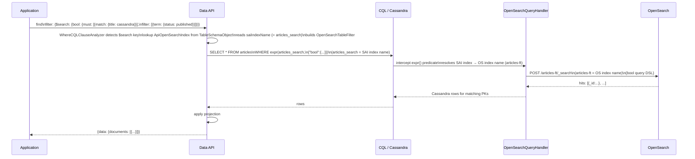

#### 4.5.3 OpenSearch fields in the Data API Payload

The `$search` filter value for tables is the same verbatim **OpenSearch Query DSL** object as for collections — see [§4.4.3](#443-opensearch-fields-in-the-data-api-payload) for the full field reference and supported query types. The only difference is that the DSL is matched against the replicated **table columns** (not unpacked JSON document fields), so field names in the DSL must match the actual column names of the table.

#### 4.5.4 Sample payloads

**Paging — `from`/`size` on a table (offset paging):**
```json
{
  "find": {
    "filter": {
      "$search": {
        "from": 0,
        "size": 20,
        "query": {
          "match": { "body": "distributed tracing observability" }
        }
      }
    }
  }
}
```
Page 2 — increment `from`:
```json
{
  "find": {
    "filter": {
      "$search": {
        "from": 20,
        "size": 20,
        "query": {
          "match": { "body": "distributed tracing observability" }
        }
      }
    }
  }
}
```

---

**Paging — `search_after` on a table (deep paging, sort by column values):**

Page 1 — sort by a score + unique column tiebreaker:
```json
{
  "find": {
    "filter": {
      "$search": {
        "size": 20,
        "query": {
          "match": { "body": "distributed tracing observability" }
        },
        "sort": [
          { "_score":     { "order": "desc" } },
          { "article_id": { "order": "asc"  } }
        ]
      }
    }
  }
}
```
Page 2 — pass the last document's sort values as `search_after`:
```json
{
  "find": {
    "filter": {
      "$search": {
        "size": 20,
        "query": {
          "match": { "body": "distributed tracing observability" }
        },
        "sort": [
          { "_score":     { "order": "desc" } },
          { "article_id": { "order": "asc"  } }
        ],
        "search_after": [0.91, 42]
      }
    }
  }
}
```
→ CQL emitted for both pages:
```cql
-- articles_search = SAI index name (user-supplied via createOpenSearchIndex.name)
SELECT * FROM mykeyspace.articles
WHERE expr(articles_search, '{"size":20,"query":{"match":{"body":"..."}},"sort":[...],"search_after":[...]}')
```

> The `sort` inside the DSL references **table column names** (`article_id`). The Data API does not transform or validate these names — they must match the column names as they appear in the OpenSearch index. No Data API `pageState` is needed for `search_after` paging; the client maintains the cursor from the last document's sort values.

---

**Simple full-text search on a table:**
```json
{
  "find": {
    "filter": {
      "$search": {
        "match": { "body": "distributed tracing observability" }
      }
    }
  }
}
```
→ CQL emitted:
```cql
-- articles_search = SAI index name (user-supplied via createOpenSearchIndex.name)
SELECT * FROM mykeyspace.articles
WHERE expr(articles_search, '{"match":{"body":"distributed tracing observability"}}')
```

---

**Multi-field search with projection:**
```json
{
  "find": {
    "filter": {
      "$search": {
        "multi_match": {
          "query": "database performance tuning",
          "fields": ["title", "body", "tags"]
        }
      }
    },
    "projection": { "title": 1, "author": 1, "published_at": 1 },
    "options": { "limit": 10 }
  }
}
```

---

**Boolean query with must + filter clauses:**
```json
{
  "find": {
    "filter": {
      "$search": {
        "bool": {
          "must": [
            { "match": { "title": "cassandra" } }
          ],
          "filter": [
            { "term": { "status": "published" } },
            { "range": { "view_count": { "gte": 1000 } } }
          ],
          "must_not": [
            { "term": { "category": "deprecated" } }
          ]
        }
      }
    },
    "options": { "limit": 25 }
  }
}
```

---

**Phrase match on a table column:**
```json
{
  "find": {
    "filter": {
      "$search": {
        "match_phrase": { "description": "real time analytics" }
      }
    }
  }
}
```

---

**Fuzzy search (OpenSearch DSL):**
```json
{
  "find": {
    "filter": {
      "$search": {
        "fuzzy": {
          "title": {
            "value": "casandra",
            "fuzziness": "AUTO"
          }
        }
      }
    }
  }
}
```

---

**`findOne` — first matching document:**
```json
{
  "findOne": {
    "filter": {
      "$search": {
        "term": { "author_id": "user-42" }
      }
    }
  }
}
```

---

**`updateOne` via `findOneAndUpdate` on a table:**
```json
{
  "findOneAndUpdate": {
    "filter": {
      "$search": {
        "match": { "title": "Introduction to CQL" }
      }
    },
    "update": {
      "$set": { "status": "archived" }
    }
  }
}
```

---

**k-NN vector search on a table — pass-through for advanced users who configure a `knn_vector` column mapping:**
```json
{
  "find": {
    "filter": {
      "$search": {
        "knn": {
          "article_embedding": {
            "vector": [0.22, 0.71, 0.45, 0.88],
            "k": 10
          }
        }
      }
    }
  }
}
```
> **Prerequisite:** the table's OpenSearch index must declare the `article_embedding` column as `"type": "knn_vector"` in `createOpenSearchIndex.definition.options.mappings`. The `vector` array length must match the declared dimension. This is a pass-through pattern — no Data API validation is performed on the DSL payload.

---

**`neural` dense vector query on a table — OpenSearch model-backed embedding lookup:**
```json
{
  "find": {
    "filter": {
      "$search": {
        "neural": {
          "article_embedding": {
            "query_text": "real-time analytics with Cassandra",
            "model_id": "aB3dEfGh",
            "k": 5
          }
        }
      }
    }
  }
}
```

---

**Error case — `$search` combined with a column filter on a table:**
```json
{
  "find": {
    "filter": {
      "$search": { "match": { "title": "tutorial" } },
      "status": "published"
    }
  }
}
```
Response:
```json
{
  "errors": [{
    "message": "$search cannot be combined with other filter operators. The $search filter must be the only condition in the filter object.",
    "errorCode": "INVALID_OPEN_SEARCH_FILTER"
  }]
}
```

---

**Error case — `$search` on a table with no OpenSearch index:**
```json
{
  "find": {
    "filter": {
      "$search": { "match": { "title": "tutorial" } }
    }
  }
}
```
Response:
```json
{
  "errors": [{
    "message": "Table 'articles' has no OpenSearch index. Use createOpenSearchIndex to create one before using the $search filter.",
    "errorCode": "OPEN_SEARCH_NOT_ENABLED"
  }]
}
```

#### 4.5.5 Implementation Tips (server)

**Behaviour rules**
- `$search` detection for tables follows the same pre-validation pattern as for collections, but occurs inside [`TableFilterResolver`](src/main/java/io/stargate/sgv2/jsonapi/service/resolver/matcher/TableFilterResolver.java) (or the `TableReadDBOperationBuilder` that calls it) rather than `CollectionFilterResolver`.
- Before any column-level filter resolution, check whether the filter has `"$search"` as its sole key. If other keys coexist, throw `INVALID_OPEN_SEARCH_FILTER`.
- Look up `ApiOpenSearchIndex` from `tableSchemaObject.apiTableDef().indexes()` by type `OPEN_SEARCH`. If none exists, throw `OPEN_SEARCH_NOT_ENABLED`.
- Build a new `OpenSearchTableFilter` (analogous to `OpenSearchCollectionFilter` but implementing `TableFilter` / `WhereCQLClause<Select>`) that wraps the DSL JSON and the **SAI index name** recovered from `ApiOpenSearchIndex.saiIndexName()`.
- `OpenSearchTableFilter.buildStatement()` renders `WHERE expr(<saiIndexName>, '<dslJson>')` using the QueryBuilder `raw()` literal or a custom `ExpressionCQLClause`.
- Pass the `OpenSearchTableFilter` as the sole where clause to [`TableReadDBTaskBuilder.build()`](src/main/java/io/stargate/sgv2/jsonapi/service/operation/tables/TableReadDBTaskBuilder.java). No `WhereCQLClauseAnalyzer` validation runs for `$search` — the analyzer's checks (PK presence, ALLOW FILTERING warnings) are not relevant for an `expr(...)` predicate.
- `sort` and `projection` work as normal — no special handling required beyond skipping the standard `WhereCQLClauseAnalyzer`.

**Todo list**
1. Create `OpenSearchTableFilter` in `service/operation/filters/table` — implements `TableFilter`; constructor takes `String saiIndexName` (the Cassandra custom index identifier, from `ApiOpenSearchIndex.saiIndexName()`) and `JsonNode queryDsl`; renders `WHERE expr(<saiIndexName>, '<dslJson>')`.
2. Add `$search` interception logic to [`TableFilterResolver`](src/main/java/io/stargate/sgv2/jsonapi/service/resolver/matcher/TableFilterResolver.java) (or `TableReadDBOperationBuilder`) — check for `"$search"` in the filter before standard column matching; validate exclusivity; look up `ApiOpenSearchIndex`; construct `OpenSearchTableFilter`.
3. Update [`WhereCQLClauseAnalyzer.StatementType.SELECT`](src/main/java/io/stargate/sgv2/jsonapi/service/operation/tables/WhereCQLClauseAnalyzer.java) strategy to short-circuit all validation rules when the where clause contains an `OpenSearchTableFilter` — the standard PK and indexing checks do not apply.
4. Update `TableReadDBOperationBuilder` to bypass the `WhereCQLClauseAnalyzer` (or pass through a no-op strategy) when an `OpenSearchTableFilter` is detected.
5. Add `OPEN_SEARCH_NOT_ENABLED` and `INVALID_OPEN_SEARCH_FILTER` to table-path error code enum if not already shared with the collection path.

**Relevant context**
- Collection parallel: `OpenSearchCollectionFilter` (new, see §4.4.5)
- Table filter pattern: [`NativeTypeTableFilter`](src/main/java/io/stargate/sgv2/jsonapi/service/operation/filters/table/NativeTypeTableFilter.java)
- Table filter resolver: [`TableFilterResolver`](src/main/java/io/stargate/sgv2/jsonapi/service/resolver/matcher/TableFilterResolver.java) — analogue of `CollectionFilterResolver` for table reads
- Where clause analyzer: [`WhereCQLClauseAnalyzer`](src/main/java/io/stargate/sgv2/jsonapi/service/operation/tables/WhereCQLClauseAnalyzer.java) — `checkLexicalFilterOnlyOnLexicalIndex` is the closest existing analogous guard; `$search` needs a similar pre-check that replaces standard analysis
- Task builder: [`TableReadDBTaskBuilder`](src/main/java/io/stargate/sgv2/jsonapi/service/operation/tables/TableReadDBTaskBuilder.java) — `build(WhereCQLClause<Select>)` called with the OpenSearch where clause
- Operation builder: [`TableReadDBOperationBuilder`](src/main/java/io/stargate/sgv2/jsonapi/service/resolver/TableReadDBOperationBuilder.java) — orchestrates filter resolution, sort, and task construction

#### 4.5.6 Implementation Tips (clients)

> Client SDK documentation: [HCD API Reference — Instantiate Client](https://docs.datastax.com/en/hyper-converged-database/2.0/api-reference/instantiate-client.html) and sub-pages.

**Java**
```java
import static io.stargate.sgv2.jsonapi.api.client.search.OpenSearchQuery.*;

// Simple full-text search on a table
table.find(
        Filters.search(match("body", "distributed tracing observability"))
        );

// Boolean query with projection and limit
        table.find(
        Filters.search(
                OpenSearchQuery.builder()
            .bool()
                .must(match("title", "cassandra"))
        .filter(term("status", "published"))
        .build()
    ),
            new FindOptions().projection(Projection.include("title", "author", "published_at")).limit(25)
);

// search_after deep paging on a table (sort by table column as tiebreaker)
// size in DSL bounds the page — do NOT pass FindOptions.limit() alongside it
var dsl = OpenSearchQuery.builder()
        .size(20)
        .query(match("body", "distributed tracing observability"))
        .sort(Sort.byScore("desc"), Sort.by("article_id", "asc"))
        .build();
List<Row> page1 = table.find(Filters.search(dsl)).into(new ArrayList<>()); // no limit()

// Page 2 — pass last row's sort values
List<Object> sortValues = page1.get(page1.size() - 1).getSortValues(); // [0.91, 42]
var dslPage2 = OpenSearchQuery.builder()
        .size(20)
        .query(match("body", "distributed tracing observability"))
        .sort(Sort.byScore("desc"), Sort.by("article_id", "asc"))
        .searchAfter(sortValues)
        .build();
table.find(Filters.search(dslPage2)); // no limit()
```

**Python**
```python
# Simple full-text search on a table
table.find({"$search": {"match": {"body": "distributed tracing observability"}}})

# Boolean query with projection
table.find(
    {
        "$search": {
            "bool": {
                "must": [{"match": {"title": "cassandra"}}],
                "filter": [{"term": {"status": "published"}}]
            }
        }
    },
    projection={"title": True, "author": True, "published_at": True},
    limit=25
)
```

**TypeScript / Node.js**
```typescript
// Simple full-text search on a table
await table.find({
  $search: { match: { body: "distributed tracing observability" } }
}).toArray();

// Boolean query with projection and limit
await table.find(
        {
          $search: {
            bool: {
              must: [{ match: { title: "cassandra" } }],
              filter: [{ term: { status: "published" } }]
            }
          }
        },
        { projection: { title: 1, author: 1, published_at: 1 }, limit: 25 }
).toArray();
```

---

---

### 4.6 `searchAggregate` — aggregations and faceted search

#### 4.6.1 Goal

`searchAggregate` is a new dedicated command that runs OpenSearch aggregation queries against a collection or table that has an OpenSearch index configured. It covers the full spectrum of analytical use cases: faceted navigation (e.g. "filter by category with counts"), histograms, date bucketing, stats (avg/sum/min/max/cardinality), and nested `top_hits` — all in a single API call.

The aggregation DSL is passed verbatim to `expr(...)` as a full OpenSearch search request body containing `aggs`. An optional `query` key scopes the aggregation to a matching subset of documents.

The command throws `OPEN_SEARCH_NOT_ENABLED` if the collection or table does not have an OpenSearch index. The response shape is **not** a document list — it is a flat map of aggregation-name → JSON result, matching exactly what OpenSearch returns.

#### 4.6.2 How it works

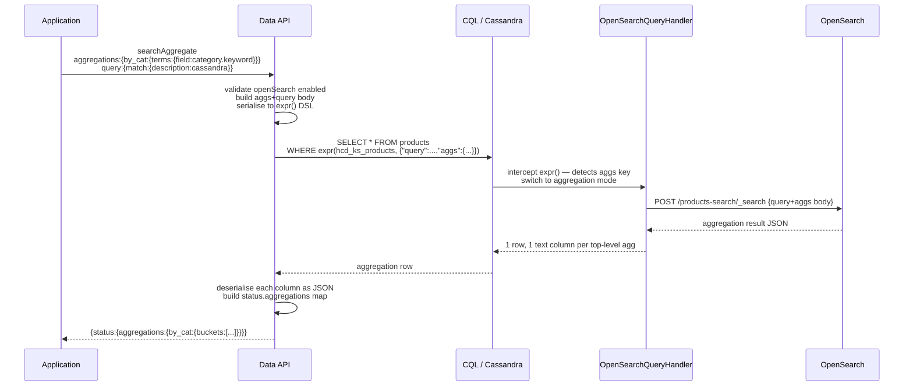

#### 4.6.3 OpenSearch fields in the Data API Payload

**Request fields:**

| Field | Required | Description |
|---|---|---|
| `aggregations` | **yes** | Map of aggregation name → OpenSearch aggregation definition. Any OpenSearch aggregation type is supported: `terms`, `date_histogram`, `range`, `avg`, `sum`, `min`, `max`, `cardinality`, `top_hits`, nested, pipeline, etc. |
| `query` | no | OpenSearch query DSL to scope the aggregation. Omit to aggregate over all indexed documents. Same syntax as the `$search` filter value. |

**Response fields (`status.aggregations`):**

| Field | Type | Description |
|---|---|---|
| `status.aggregations` | Object | Map of aggregation name → raw OpenSearch aggregation result. Each value is the JSON subtree returned by OpenSearch for that aggregation. Structure depends on the aggregation type. |
| `status.aggregations.<name>.buckets` | Array | For bucket aggregations (`terms`, `date_histogram`, `range`). Each bucket has `key`, `doc_count`, and any nested aggregation results. |
| `status.aggregations.<name>.value` | Number | For metric aggregations (`avg`, `sum`, `min`, `max`, `cardinality`). |

> **`OPEN_SEARCH_NOT_ENABLED`**: thrown when `searchAggregate` is called on a collection that was not created with `openSearch.enabled: true`, or on a table with no `createOpenSearchIndex`. Error message identifies whether the resource is a collection or table.

> **`OPEN_SEARCH_AGGREGATION_TOO_LARGE`**: thrown when the OpenSearch response for a single aggregation exceeds the `max_agg_json_bytes` limit (default 1 MiB) or the full response exceeds `max_agg_response_bytes` (default 16 MiB). These bounds are enforced by `OpenSearchQueryHandler` before the result reaches the Data API. Reduce aggregation scope (e.g. lower `size` on `terms`) or add a `query` to narrow the dataset.

#### 4.6.4 Sample payloads

---

**Faceted navigation — category counts + price range buckets:**
```json
{
  "searchAggregate": {
    "query": {
      "match": { "description": "cassandra database" }
    },
    "aggregations": {
      "by_category": {
        "terms": { "field": "category.keyword", "size": 10 }
      },
      "price_ranges": {
        "range": {
          "field": "price",
          "ranges": [
            { "to": 25 },
            { "from": 25, "to": 100 },
            { "from": 100 }
          ]
        }
      }
    }
  }
}
```
Response:
```json
{
  "status": {
    "aggregations": {
      "by_category": {
        "buckets": [
          { "key": "database",    "doc_count": 42 },
          { "key": "distributed", "doc_count": 18 }
        ]
      },
      "price_ranges": {
        "buckets": [
          { "key": "*-25.0",    "to": 25,  "doc_count": 7  },
          { "key": "25.0-100.0","from": 25,"to": 100,"doc_count": 28 },
          { "key": "100.0-*",   "from": 100,           "doc_count": 13 }
        ]
      }
    }
  }
}
```

---

**Date histogram + nested avg — articles per month with average word count:**
```json
{
  "searchAggregate": {
    "aggregations": {
      "articles_per_month": {
        "date_histogram": {
          "field": "published_at",
          "calendar_interval": "month"
        },
        "aggs": {
          "avg_word_count": { "avg": { "field": "word_count" } }
        }
      }
    }
  }
}
```
Response:
```json
{
  "status": {
    "aggregations": {
      "articles_per_month": {
        "buckets": [
          { "key_as_string": "2024-11-01", "key": 1730419200000, "doc_count": 14,
            "avg_word_count": { "value": 823.5 } },
          { "key_as_string": "2024-12-01", "key": 1733011200000, "doc_count": 22,
            "avg_word_count": { "value": 1102.0 } }
        ]
      }
    }
  }
}
```

---

**Multiple metric aggregations — total revenue + unique customer count:**
```json
{
  "searchAggregate": {
    "query": {
      "term": { "status": "completed" }
    },
    "aggregations": {
      "total_revenue":    { "sum":         { "field": "amount" } },
      "avg_order_value":  { "avg":         { "field": "amount" } },
      "unique_customers": { "cardinality": { "field": "customer_id.keyword" } }
    }
  }
}
```
Response:
```json
{
  "status": {
    "aggregations": {
      "total_revenue":    { "value": 48293.50 },
      "avg_order_value":  { "value": 127.35 },
      "unique_customers": { "value": 379 }
    }
  }
}
```

---

**Error — `searchAggregate` on a collection without OpenSearch:**
```json
{
  "searchAggregate": {
    "aggregations": {
      "by_category": { "terms": { "field": "category.keyword" } }
    }
  }
}
```
Response:
```json
{
  "errors": [{
    "message": "The collection 'products' does not have an OpenSearch index. Enable openSearch at collection creation time to use searchAggregate.",
    "errorCode": "OPEN_SEARCH_NOT_ENABLED"
  }]
}
```

---

**Error — aggregation response too large:**
```json
{
  "errors": [{
    "message": "The aggregation 'all_terms' response exceeds the maximum allowed size (1 MiB). Reduce the aggregation 'size' parameter or narrow the query scope.",
    "errorCode": "OPEN_SEARCH_AGGREGATION_TOO_LARGE"
  }]
}
```

#### 4.6.5 Implementation Tips (server)

**Behaviour rules**
- `searchAggregate` is a new collection-level and table-level command, registered in the command router alongside `find` and `countDocuments`.
- On collections: validate `collectionSchemaObject.openSearchDef().enabled()`. If `false`, throw `OPEN_SEARCH_NOT_ENABLED` with a message naming the collection.
- On tables: look up `ApiOpenSearchIndex` from `tableSchemaObject.apiTableDef().indexes()`. If absent, throw `OPEN_SEARCH_NOT_ENABLED` with a message naming the table.
- Build the OpenSearch search request body: `{ "query": <optional>, "aggs": <required> }` and serialise to JSON string.
- Emit: `SELECT * FROM <table> WHERE expr(<saiIndexName>, '<aggs-body>')`, where `<saiIndexName>` is the **SAI index name** (auto-generated for collections; user-supplied for tables).
- `OpenSearchQueryHandler` switches to aggregation mode when it sees an `aggs` key. It returns **one CQL row** with one `text` column per top-level aggregation name.
- The Data API reads each column as a JSON string, parses it, and builds the `status.aggregations` response map. Keys are the aggregation names as specified by the client — verbatim, not lowercased.
- Map the two HCD size errors (`OPEN_SEARCH_AGGREGATION_TOO_LARGE`) from `InvalidRequestException` messages that contain the bound strings.
- `LIMIT` is rejected by HCD on aggregation queries — do not pass `options.limit` to the CQL statement.

**CQL emitted:**
```cql
-- hcd_mykeyspace_products = SAI index name (auto-generated for collections)
SELECT * FROM mykeyspace.products
WHERE expr(hcd_mykeyspace_products,
  '{"query":{"match":{"description":"cassandra"}},
    "aggs":{"by_category":{"terms":{"field":"category.keyword","size":10}}}}')
```

**Todo list**
1. Create `SearchAggregateCommand` record in `api/model/command/impl` — fields: `JsonNode aggregations` (required), `JsonNode query` (optional).
2. Create `SearchAggregateCommandResolver` in `service/resolver` — validates OpenSearch enabled, builds `expr(...)` body from `aggregations` + optional `query`, dispatches to new `SearchAggregateOperation`.
3. Create `SearchAggregateOperation` in `service/operation` — emits `SELECT * FROM … WHERE expr(...)`, reads the one-row result, maps columns to `status.aggregations`.
4. Add `OPEN_SEARCH_NOT_ENABLED` guard (reuse existing code); add `OPEN_SEARCH_AGGREGATION_TOO_LARGE` error code mapped from HCD's `InvalidRequestException`.
5. Register the command in the command router for both collection-level and table-level namespaces.
6. Unit tests: aggs-only body, aggs + query body, missing OpenSearch index → error, oversized response → error.

**Relevant context**
- Command pattern: [`CountDocumentsCommand`](src/main/java/io/stargate/sgv2/jsonapi/api/model/command/impl/CountDocumentsCommand.java)
- Operation pattern: [`CountCollectionOperation`](src/main/java/io/stargate/sgv2/jsonapi/service/operation/collections/CountCollectionOperation.java)
- Error mapping: existing `OPEN_SEARCH_NOT_ENABLED` guard in `CollectionFilterResolver`

#### 4.6.6 Implementation Tips (clients)

> Client SDK documentation: [HCD API Reference — Instantiate Client](https://docs.datastax.com/en/hyper-converged-database/2.0/api-reference/instantiate-client.html) and sub-pages.

**Java — using `OpenSearchQueryBuilder` (recommended)**
```java
// Faceted search — category counts + price ranges
AggregationResult result = collection.searchAggregate(
                OpenSearchQuery.builder()
                        .match("description", "cassandra database")
                        .build(),
                OpenSearchAggregations.builder()
                        .terms("by_category", "category.keyword", 10)
                        .range("price_ranges", "price",
                                Range.to(25), Range.between(25, 100), Range.from(100))
                        .build()
        );

result.getBuckets("by_category").forEach(b ->
        System.out.println(b.getKey() + ": " + b.getDocCount())
        );

// Metrics — no query scope (aggregate all)
AggregationResult metrics = collection.searchAggregate(
        null,   // no query — aggregate all documents
        OpenSearchAggregations.builder()
                .sum("total_revenue", "amount")
                .avg("avg_order", "amount")
                .cardinality("unique_customers", "customer_id.keyword")
                .build()
);
double revenue = metrics.getMetricValue("total_revenue");
```

**Python — using the `OpenSearchQueryBuilder`**
```python
from astrapy.search import query as q, agg as a

# Faceted search
result = collection.search_aggregate(
    query=q.match("description", "cassandra database"),
    aggregations={
        "by_category": a.terms("category.keyword", size=10),
        "price_ranges": a.range("price", ranges=[
            {"to": 25}, {"from": 25, "to": 100}, {"from": 100}
        ])
    }
)

for bucket in result["by_category"]["buckets"]:
    print(f"{bucket['key']}: {bucket['doc_count']}")

# Metrics — aggregate all documents
metrics = collection.search_aggregate(
    aggregations={
        "total_revenue":    a.sum("amount"),
        "avg_order":        a.avg("amount"),
        "unique_customers": a.cardinality("customer_id.keyword")
    }
)
print(metrics["total_revenue"]["value"])
```

**TypeScript / Node.js — using `OpenSearchQueryBuilder`**
```typescript
import { openSearch } from "@datastax/astra-db-ts";
const { match, terms, range, sum, avg, cardinality } = openSearch;

// Faceted search
const result = await collection.searchAggregate({
  query: match("description", "cassandra database"),
  aggregations: {
    by_category: terms("category.keyword", { size: 10 }),
    price_ranges: range("price", [{ to: 25 }, { from: 25, to: 100 }, { from: 100 }])
  }
});

for (const bucket of result.by_category.buckets) {
  console.log(`${bucket.key}: ${bucket.doc_count}`);
}

// Metrics
const metrics = await collection.searchAggregate({
  aggregations: {
    total_revenue:    sum("amount"),
    avg_order:        avg("amount"),
    unique_customers: cardinality("customer_id.keyword")
  }
});
console.log(metrics.total_revenue.value);
```

---

### 4.7 `countDocuments` with `$search` filter

#### 4.7.1 Goal

The existing `countDocuments` command is extended to accept a `$search` filter. When `$search` is present in the filter, the count is resolved by OpenSearch via `SELECT COUNT(*) FROM … WHERE expr(...)`. The result is the number of documents matching the OpenSearch query — not a Cassandra row count.

This is distinct from a standard `countDocuments` with a normal filter (which uses Cassandra's native counting). The two paths are independent — any filter that uses `$search` is routed to OpenSearch; any other filter stays on the Cassandra path.

> **Tables:** `countDocuments` is currently **not supported for Tables** in the Data API. This section applies to **Collections only**. Table support for `countDocuments` (with or without `$search`) is out of scope for this version.

`OPEN_SEARCH_NOT_ENABLED` is thrown if the collection has no OpenSearch index, regardless of whether the query would have matched documents.

#### 4.7.2 How it works

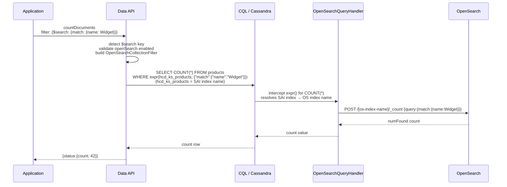

> Note: HCD returns the OpenSearch `numFound` as the count — not the Cassandra row count. For eventually-consistent indexes (recently written documents not yet replicated) the count may lag slightly.

#### 4.7.3 OpenSearch fields in the Data API Payload

The `filter.$search` value is identical to its use in `find` — a verbatim OpenSearch Query DSL object. See §4.4.3 for the full field reference.

| Request field | Required | Description |
|---|---|---|
| `filter.$search` | **yes** (for this path) | OpenSearch Query DSL. Must be the only key in the filter object. |

| Response field | Type | Description |
|---|---|---|
| `status.count` | Integer | Number of documents matching the OpenSearch query according to OpenSearch's `numFound`. |

> **`OPEN_SEARCH_NOT_ENABLED`**: thrown when the collection was not created with `openSearch.enabled: true` (collections) or has no `createOpenSearchIndex` (tables). Error message identifies the resource by name.

#### 4.7.4 Sample payloads

**Count documents matching a full-text query:**
```json
{
  "countDocuments": {
    "filter": {
      "$search": {
        "match": { "description": "cassandra distributed database" }
      }
    }
  }
}
```
Response:
```json
{
  "status": { "count": 127 }
}
```

---

**Count with a boolean query:**
```json
{
  "countDocuments": {
    "filter": {
      "$search": {
        "bool": {
          "must":   [{ "match": { "title": "cassandra" } }],
          "filter": [{ "term":  { "status": "published" } }]
        }
      }
    }
  }
}
```
Response:
```json
{
  "status": { "count": 43 }
}
```

---

**Count all OpenSearch-indexed documents (match_all):**
```json
{
  "countDocuments": {
    "filter": {
      "$search": { "match_all": {} }
    }
  }
}
```

---

**Error — `$search` on a collection without OpenSearch:**
```json
{
  "errors": [{
    "message": "The collection 'articles' does not have an OpenSearch index. Enable openSearch at collection creation time to use $search with countDocuments.",
    "errorCode": "OPEN_SEARCH_NOT_ENABLED"
  }]
}
```

---

**Error — `$search` combined with another filter:**
```json
{
  "countDocuments": {
    "filter": {
      "$search": { "match": { "title": "tutorial" } },
      "status": "published"
    }
  }
}
```
Response:
```json
{
  "errors": [{
    "message": "$search cannot be combined with other filter operators. The $search filter must be the only condition in the filter object.",
    "errorCode": "INVALID_OPEN_SEARCH_FILTER"
  }]
}
```

#### 4.7.5 Implementation Tips (server)

**Behaviour rules**
- Detect `$search` in the filter inside the `countDocuments` resolver, before the standard filter path — same early intercept pattern as in `CollectionFilterResolver`.
- On collections: validate `collectionSchemaObject.openSearchDef().enabled()`. If `false`, throw `OPEN_SEARCH_NOT_ENABLED` naming the collection.
- On tables: look up `ApiOpenSearchIndex`. If absent, throw `OPEN_SEARCH_NOT_ENABLED` naming the table.
- Build `OpenSearchCollectionFilter` (or `OpenSearchTableFilter`) from the `$search` value — the **same filter class** used by the `find` command. Reuse without duplication.
- Emit `SELECT COUNT(*) FROM <table> WHERE expr(<saiIndexName>, '<dsl>')` instead of the normal count query, where `<saiIndexName>` is the **SAI index name** (auto-generated for collections; user-supplied for tables).
- The count result comes from `OpenSearchQueryHandler.numFound` (via the custom payload), not from a Cassandra row scan — the value is the OpenSearch hit count, not the Cassandra storage count.
- If `$search` coexists with other filter keys → `INVALID_OPEN_SEARCH_FILTER` (same code as in `find`).

**Todo list**
1. Add `$search` interception to `CountDocumentsCommandResolver` — detect before standard filter resolution (collections only; no table-equivalent needed for this version).
2. Reuse `OpenSearchCollectionFilter` — no new filter class needed.
3. Update `CountCollectionOperation` to emit `SELECT COUNT(*) WHERE expr(...)` when an `OpenSearchCollectionFilter` is detected.
4. The count value is returned via the standard CQL count row — HCD's `OpenSearchQueryHandler` intercepts `SELECT COUNT(*)` with an `expr(...)` predicate and returns the OpenSearch `numFound` value as a CQL long column, same as a normal Cassandra count. No special payload channel is required.
5. Extend error handling: `OPEN_SEARCH_NOT_ENABLED` (reuse existing), `INVALID_OPEN_SEARCH_FILTER` (reuse existing).

**Relevant context**
- Command: [`CountDocumentsCommand`](src/main/java/io/stargate/sgv2/jsonapi/api/model/command/impl/CountDocumentsCommand.java)
- Resolver: `CountDocumentsCommandResolver` (collections)
- Operation: [`CountCollectionOperation`](src/main/java/io/stargate/sgv2/jsonapi/service/operation/collections/CountCollectionOperation.java)
- Reuse filter: `OpenSearchCollectionFilter` (new, see §4.4.5)

#### 4.7.6 Implementation Tips (clients)

> Client SDK documentation: [HCD API Reference — Instantiate Client](https://docs.datastax.com/en/hyper-converged-database/2.0/api-reference/instantiate-client.html) and sub-pages.

**Java**
```java
// Count with a match query
long count = collection.countDocuments(
                Filters.search(
                        OpenSearchQuery.builder()
                                .match("description", "cassandra distributed database")
                                .build()
                )
        );

// Count with a boolean query
long publishedCount = collection.countDocuments(
        Filters.search(
                OpenSearchQuery.builder()
                        .bool()
                        .must(OpenSearchQuery.match("title", "cassandra"))
                        .filter(OpenSearchQuery.term("status", "published"))
                        .build()
        )
);
```

**Python**
```python
from astrapy.search import query as q

# Count with a match query
count = collection.count_documents(
    filter={"$search": q.match("description", "cassandra distributed database")}
)

# Count with a boolean query
published_count = collection.count_documents(
    filter={"$search": q.bool(
        must=[q.match("title", "cassandra")],
        filter=[q.term("status", "published")]
    )}
)
```

**TypeScript / Node.js**
```typescript
import { openSearch } from "@datastax/astra-db-ts";
const { match, bool, term } = openSearch;

// Count with a match query
const count = await collection.countDocuments({
  $search: match("description", "cassandra distributed database")
});

// Count with a boolean query
const publishedCount = await collection.countDocuments({
  $search: bool({
    must:   [match("title", "cassandra")],
    filter: [term("status", "published")]
  })
});
```

---

### 4.8 `deleteCollection` — also drops the OpenSearch index

#### 4.8.1 Goal

`deleteCollection` has an unchanged API signature. When the collection being deleted was created with `openSearch.enabled: true`, the implementation must drop the associated OpenSearch custom index **before** dropping the Cassandra table, otherwise the `DROP TABLE` succeeds but the orphaned Cassandra custom index (which depends on the table) would leave an inconsistent state. When `openSearch` was not enabled, the behaviour is unchanged.

> **Cassandra dependency order.** A Cassandra custom index depends on its backing table — you cannot drop the table while the index exists on some nodes (it will error or leave ghost metadata). The correct CQL sequence is always: `DROP INDEX` first, then `DROP TABLE`. For non-OpenSearch collections the Data API already does this for any SAI or other custom indexes present. For OpenSearch-enabled collections the Data API must additionally drop the OpenSearch custom index in the same pre-drop step.

> **HCD side-effect.** When HCD processes a `DROP INDEX` on an OpenSearch custom index, it also deletes the corresponding OpenSearch index from the OS cluster (the `indexName` stored in `WITH OPTIONS`). This is automatic and transparent — the Data API does not need to call the OpenSearch REST API directly. After `DROP INDEX` completes, the OS index no longer exists.

#### 4.8.2 How it works

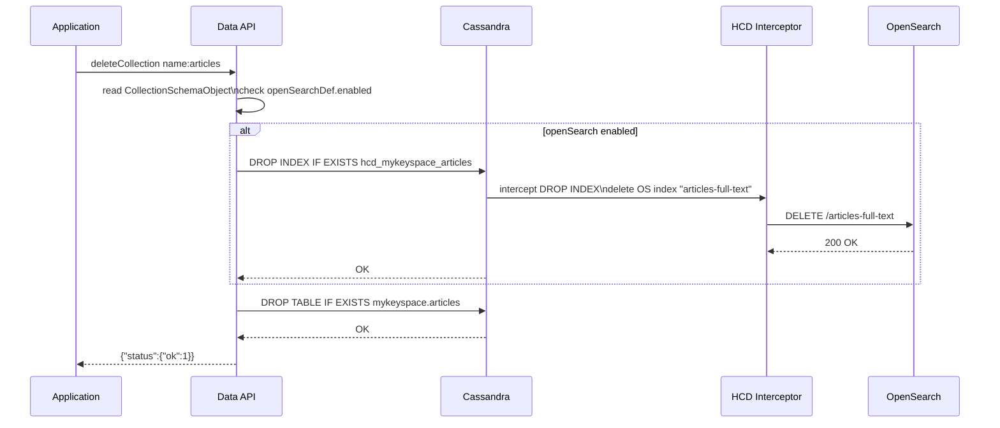

#### 4.8.3 Implementation Tips (server)

**Behaviour rules**
- Read `collectionSchemaObject.openSearchDef().enabled()` in `DeleteCollectionOperation` (or its equivalent task builder) before issuing DDL.
- If `enabled == true`: emit `DROP INDEX IF EXISTS <saiIndexName>` first, then `DROP TABLE IF EXISTS`. Both statements must complete successfully; use `IF EXISTS` on both so concurrent deletes are idempotent.
- If `enabled == false` (or `openSearchDef` absent — V1/V2 schema): proceed as today — drop the table directly. No change to existing behaviour.
- The SAI index name for collections is always `hcd_<keyspace>_<collectionName>` (auto-generated, stored in `collectionOpenSearchDef.saiIndexName`).
- Error during `DROP INDEX` (e.g. OS cluster unreachable): the Data API should surface this as a failure rather than silently skipping it and dropping the table. A partially-deleted state (table gone, index orphaned or vice versa) is worse than leaving both intact and letting the caller retry.

**CQL emitted**
```cql
-- Step 1: drop the OpenSearch custom index (triggers HCD to delete the OS index)
DROP INDEX IF EXISTS hcd_mykeyspace_articles;

-- Step 2: drop the collection table
DROP TABLE IF EXISTS mykeyspace.articles;
```

**Todo list**
1. In `DeleteCollectionOperation` (or `DropCollectionDBTask`), read `collectionSchemaObject.openSearchDef().enabled()`.
2. If `true`, prepend a `DROP INDEX IF EXISTS <saiIndexName>` CQL statement to the DDL sequence — before the `DROP TABLE`.
3. Confirm the SAI index name is reliably available from `collectionOpenSearchDef.saiIndexName()` at deletion time (it is persisted in the collection comment JSON at creation time).
4. Unit tests: V3 collection with `openSearch.enabled: true` → both DROP INDEX and DROP TABLE emitted in order; V2 collection (no `openSearch`) → only DROP TABLE emitted.

**Relevant context**
- Operation: [`DeleteCollectionOperation`](src/main/java/io/stargate/sgv2/jsonapi/service/operation/collections/DeleteCollectionOperation.java)
- Schema: `collectionSchemaObject.openSearchDef()` — available at deletion time via the schema read-back path

#### 4.8.4 Implementation Tips (clients)

The `deleteCollection` API surface is unchanged. Client code requires no modification.

**Java**
```java
// Unchanged — deleteCollection works the same regardless of whether OpenSearch is enabled.
// The Data API handles DROP INDEX internally before dropping the table.
database.deleteCollection("articles");
```

**Python**
```python
# Unchanged
database.drop_collection("articles")
```

**TypeScript / Node.js**
```typescript
// Unchanged
await db.dropCollection("articles");
```

---

### 4.9 `dropIndex` on Tables — drops the OpenSearch custom index

#### 4.9.1 Goal

The existing `dropIndex` command (which drops SAI, text, and vector indexes from tables) must also handle OpenSearch indexes created via `createOpenSearchIndex`. The API signature is unchanged — the caller passes the SAI index name (the Cassandra custom index identifier) and optionally `ifExists`. The implementation must recognise that the target is an OpenSearch-type index and route through the same drop path.

> **HCD side-effect.** As with `deleteCollection`, when HCD processes a `DROP INDEX` on an OpenSearch custom index it automatically deletes the corresponding OS index from the OpenSearch cluster. The Data API does not need to call OpenSearch directly.

> **Scope.** `dropIndex` drops only the index — not the table. After `dropIndex`, the table remains intact and writable; it simply no longer replicates to OpenSearch and `$search` queries on it will return `OPEN_SEARCH_NOT_ENABLED`.

#### 4.9.2 How it works

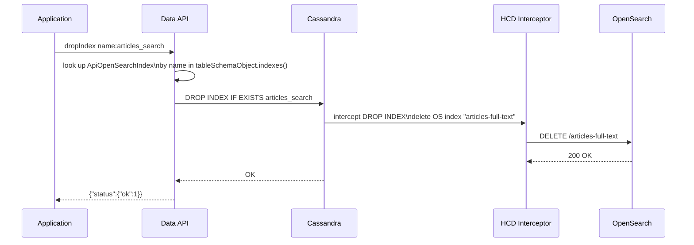

#### 4.9.3 Implementation Tips (server)

**Behaviour rules**
- `dropIndex` already issues `DROP INDEX [IF EXISTS] <name>`. The SAI index name for OpenSearch indexes is the user-supplied `name` from `createOpenSearchIndex`.
- The only required change is ensuring `IndexFactoryFromCql.isSupported()` recognises the `OPEN_SEARCH` class name (see §5.5) so that `ApiOpenSearchIndex` is resolved from schema metadata rather than falling back to `UnsupportedIndex`. Without this, the resolver cannot confirm the index type and may reject the operation.
- `IF EXISTS` handling follows the same pattern as other index types — map `options.ifNotExists` to `IF EXISTS` in the CQL statement.
- After the `DROP INDEX` completes, `listIndexes` must no longer return an entry for this index name. No extra cleanup step is required — Cassandra schema metadata is updated by the `DROP INDEX` itself.
- No validation against the OS cluster is required — HCD handles the OS-side deletion transparently.

**CQL emitted**
```cql
-- ifExists: true
DROP INDEX IF EXISTS articles_search;

-- ifExists: false (default) — errors if the index does not exist
DROP INDEX articles_search;
```

**Todo list**
1. Confirm `IndexFactoryFromCql.isSupported()` returns `true` for `class_name = 'OpenSearchIndex'` (§5.5 todo). If not, `dropIndex` will silently treat the index as `UnsupportedIndex` and may refuse the operation.
2. Verify `DropIndexCommandResolver` (or `DropIndexDBTask`) accepts `ApiIndexType.OPEN_SEARCH` indexes — no special-casing should be needed since the CQL `DROP INDEX` statement is type-agnostic, but confirm no guard blocks non-SAI types.
3. Integration test: create a table, call `createOpenSearchIndex`, call `dropIndex`, verify `listIndexes` returns empty and `$search` returns `OPEN_SEARCH_NOT_ENABLED`.

**Relevant context**
- Command: `DropIndexCommand` (existing)
- Resolver: `DropIndexCommandResolver` (existing)
- Factory: [`IndexFactoryFromCql`](src/main/java/io/stargate/sgv2/jsonapi/service/schema/tables/factories/IndexFactoryFromCql.java) — must recognise `OpenSearchIndex` class name (see §5.5)

#### 4.9.4 Implementation Tips (clients)

The `dropIndex` API surface is unchanged. Client code requires no modification.

**Java**
```java
// Unchanged — same call regardless of index type
database.getTable("articles").dropIndex("articles_search");

// With ifExists guard
database.getTable("articles").dropIndex("articles_search",
                                        DropIndexOptions.builder().ifExists(true).build());
```

**Python**
```python
# Unchanged
table = database.get_table("articles")
table.drop_index("articles_search")

# With if_exists guard
table.drop_index("articles_search", if_exists=True)
```

**TypeScript / Node.js**
```typescript
// Unchanged
const table = db.table("articles");
await table.dropIndex("articles_search");

// With ifExists guard
await table.dropIndex("articles_search", { ifExists: true });
```

---


## 5. Cross-Cutting Concerns

### 5.1 Class hierarchy

> **Diagram 7 — New classes in context.** Shows where each new class sits inside the existing Data API type hierarchy.

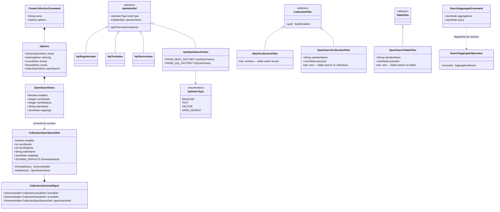

---

### 5.2 Schema version evolution

> **Diagram 8 — CollectionSchemaVersion chain.** Shows how the new V_3 extends the existing version ladder and how old collections are handled on read.

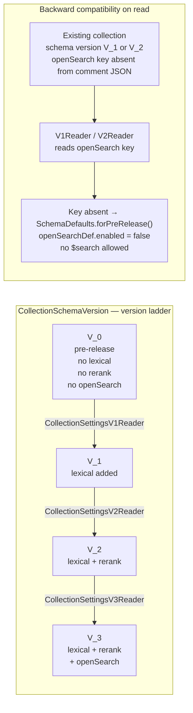

---

### 5.3 Error codes
New `SchemaException.Code` (or `FilterException.Code`) values to add:

| Code | When thrown |
|------|-------------|
| `OPEN_SEARCH_NOT_ENABLED` | Any OpenSearch command (`$search`, `searchAggregate`, `countDocuments` with `$search`) used on a collection/table that has no OpenSearch index configured. Applies to both collections (no `openSearch.enabled: true` at creation) and tables (no `createOpenSearchIndex` run). |
| `INVALID_OPEN_SEARCH_FILTER` | `$search` combined with any other filter operator in the same filter object, or `options.limit` set alongside a `"size"` key in the `$search` DSL (HCD rejects a CQL `LIMIT` combined with a DSL `size`). |
| `OPEN_SEARCH_INCOMPATIBLE_WITH_DENY_LIST` | `openSearch.enabled: true` + `indexing.deny` at collection creation. |
| `OPEN_SEARCH_INDEX_ALREADY_EXISTS` | Attempting to create a second OpenSearch index on the same table. |
| `OPEN_SEARCH_AGGREGATION_TOO_LARGE` | An aggregation response from OpenSearch exceeds the `max_agg_json_bytes` or `max_agg_response_bytes` bounds imposed by `OpenSearchQueryHandler`. Mirrors the HCD-level size guard. |
| `OPEN_SEARCH_COMMAND_NOT_SUPPORTED` | A `searchAggregate` or `countDocuments` with `$search` is attempted on a resource type where the command is not supported (e.g. `searchAggregate` on a single-document endpoint). Reserved for future constraint enforcement. |
| `OPEN_SEARCH_CORRUPT_SCHEMA` | `CollectionSettingsV3Reader` finds a V3 collection with `openSearch.enabled: true` but a null `indexName` in the stored comment. This indicates the comment was written incorrectly at creation time. Thrown instead of silently recomputing a default, which could return wrong information and later cause `expr(...)` queries against a non-existent SAI index. |
| `OPEN_SEARCH_MISSING_FIELD_MAPPINGS` | `createCollection` with `openSearch.enabled: true` is missing `mappings`, or `mappings` is empty, or `_id` appears as a key in `mappings`. There is no auto-inference path for collections. |
| `RERANK_NOT_SUPPORTED_WITH_OPEN_SEARCH` | `findAndRerank` called with a `$search` filter. The rerank pipeline does not support OpenSearch-backed result sets — block at `FindAndRerankCommandResolver` before `FindAndRerankOperationBuilder` constructs the inner `FindCommand`. |

### 5.4 `CollectionSchemaVersion`
The new `openSearch` field in the collection comment JSON requires schema version **V_3**. The existing V1/V2 readers must handle the absent `openSearch` key gracefully by returning `SchemaDefaults.forPreRelease()` (maps to `enabled: false`).

### 5.5 `isSupported()` check in `IndexFactoryFromCql`
The current `IndexFactoryFromCql.isSupported()` method only accepts SAI indexes (`CQLSAIIndex.isSAIIndex()`). OpenSearch indexes have `class_name = 'OpenSearchIndex'` which will fail that check. The method must be updated to also return `true` for the OpenSearch class name, otherwise existing OpenSearch indexes on a table will be silently represented as `UnsupportedIndex` when the schema is read.

### 5.6 HCD feature flag
An operator-level feature flag should gate these features (same pattern as `lexical` / `rerank`). Check whether a `FeatureFlagResolver` or equivalent already exists before introducing a new one.

### 5.7 Testing
Each sub-task should include:
- Unit tests for the new `*Def` / `*Filter` / `*Index` classes.
- Integration tests using `@QuarkusTest` for the command resolver → operation → CQL generation path.
- Schema round-trip tests: create collection with `openSearch`, read back via `findCollections`, verify serialised options match.
- Negative tests: `$search` + other filters, `$search` with no index, deny-list + openSearch.

**Additional test cases for `searchAggregate`:**
- `terms` aggregation scoped by a `match` query — verify `status.aggregations.*.buckets` shape.
- `date_histogram` with nested `avg` — verify bucket key format and nested aggregation value.
- Multiple metric aggregations (`sum`, `avg`, `cardinality`) — verify all values present in response map.
- `searchAggregate` on collection without `openSearch.enabled: true` → `OPEN_SEARCH_NOT_ENABLED`.
- `searchAggregate` on table without `createOpenSearchIndex` → `OPEN_SEARCH_NOT_ENABLED`.
- Oversized aggregation response mock → `OPEN_SEARCH_AGGREGATION_TOO_LARGE`.
- Aggregation keys are returned verbatim (not lowercased or transformed).

**Additional test cases for `countDocuments` with `$search`:**
- `countDocuments` with `match` query on collection — verify `status.count` equals OpenSearch `numFound`.
- `countDocuments` with `bool` query (must + filter) — verify correct count returned.
- `countDocuments` with `match_all` — verify count equals total indexed document count.
- `countDocuments` with `$search` + another filter key → `INVALID_OPEN_SEARCH_FILTER`.
- `countDocuments` with `$search` on collection without OpenSearch → `OPEN_SEARCH_NOT_ENABLED`.
- `countDocuments` with `$search` on table without OpenSearch index → `OPEN_SEARCH_NOT_ENABLED`.
- Verify `OpenSearchCollectionFilter` / `OpenSearchTableFilter` are shared between `find` and `countDocuments` — no duplicated filter class.

---

### 5.8 Write consistency and read-after-write guarantees

This section documents the consistency model between Cassandra writes and OpenSearch query results. Understanding these guarantees is essential for correct client behaviour and for writing reliable integration tests.

#### Eventual consistency — not read-my-writes

**OpenSearch replication is eventually consistent.** There is always a lag between the moment a document is written to Cassandra and the moment it becomes visible in OpenSearch `$search` or `searchAggregate` results. Clients must never assume that a write is immediately queryable via OpenSearch.

The pipeline has two independent delay sources:

| Stage | Latency | Controlled by |
|---|---|---|
| **HCD replication** | Typically < 1 s | `BulkProcessor` batches up to 1 000 docs, flushes every 1 s |
| **OpenSearch refresh** | Typically 1 s for active indexes | OpenSearch's own refresh cycle (see below) |

End-to-end, a freshly inserted document should normally be searchable within **1–2 seconds** under typical load, but this is not guaranteed and can be higher under index pressure.

> **Do not use `$search` results as a read-my-writes consistency check.** To confirm a write landed in Cassandra, use a normal `find` with a regular filter — not `$search`. OpenSearch is a search replica, not the source of truth.

#### LWT (Lightweight Transaction) support

HCD intercepts **all** write path operations, including Lightweight Transactions (Paxos v1 and Paxos v2). The guarantee is:

- LWT outcomes are **eventually** reflected in OpenSearch — not immediately.
- If an LWT is recovered later (e.g. by a SERIAL read or another LWT that triggers Paxos reconciliation), HCD's `Replicator` intercepts the reconciliation and re-applies the correct value to OpenSearch.
- There is no direct LWT equivalent in OpenSearch. The OpenSearch replica is updated after the Cassandra Paxos round completes and HCD processes the write.

> **LWTs do not provide read-my-writes on the OpenSearch side.** After a conditional `insertOne` or `findOneAndUpdate` with a `$exists` guard, the result is visible in Cassandra immediately (at the agreed consistency level) but will only appear in OpenSearch after the replication + refresh cycle.

#### OpenSearch refresh interval

OpenSearch moves indexed documents into searchable segments via a **refresh** operation. By default:

- Indexes that have received at least one search request in the past 30 seconds are refreshed **every 1 second**.
- Indexes with no recent search activity are not refreshed automatically (to reduce overhead).

This means a document written to an active index is typically searchable within **~1 second**, but a quiet index may not expose a write until the next explicit or triggered refresh.

For reference: [OpenSearch — Optimize Refresh Interval](https://opensearch.org/blog/optimize-refresh-interval/)

> **PO decision — `refresh` parameter not exposed on `find`.** A `refresh` query option that forces an OpenSearch index refresh before executing the search was considered. Decision: **do not expose it.** Forcing a refresh on every read is a heavy operation that defeats the purpose of OpenSearch's buffered indexing model and would significantly degrade throughput for all other readers of the same index. Applications that need read-my-writes semantics should instead use the normal Cassandra `find` path (not `$search`) for confirming writes, and accept the ~1–2 s eventual visibility window for OpenSearch queries.

#### HCD query path performance improvements (internal — no Data API surface impact)

The HCD `OpenSearchQueryHandler` received several performance improvements that benefit all `$search`, `searchAggregate`, and `countDocuments` queries transparently:

- **Batched Cassandra reads:** hits returned by OpenSearch are now resolved in configurable-size batches (default 100, tunable via `cassandra.opensearch.lookup.batch_size`) submitted as a `SinglePartitionReadCommand.Group`, so all replica round-trips in a batch are fanned out concurrently. Previous behaviour was one read per hit, serialised. This is the main latency improvement for large result sets.
- **`source_only` path (tables only):** a `source_only: true` option in the `expr(...)` envelope bypasses Cassandra reads entirely and builds results from OpenSearch document source. Not useful for collections because `doc_json` is never replicated to OpenSearch — see §4.4.5 paging notes.
- **Live config reload:** `lookupBatchSize` and other config values can be reloaded via `reloadConfiguration` without a node restart.

None of these changes affect the Data API wire format or client behaviour.

#### Integration test pattern

Integration tests that write a document and immediately assert it is visible via `$search` **must** call the OpenSearch Refresh API between the write and the read, otherwise the test will flake:

```http
POST /<index-name>/_refresh
```

In the HCD integration test suite this is done via a helper that calls the Refresh API before any assertion on `$search` or `searchAggregate` results. **Never rely on `Thread.sleep()` as a substitute** — refresh timing is not deterministic.

```java
// Force refresh before asserting search results
openSearchClient.indices().refresh(r -> r.index(indexName));

// Now safe to assert
List<Document> results = collection.find(
        Filter.search(match("firstName", "Alice"))
).into(new ArrayList<>());
assertThat(results).hasSize(1);
```

---

## 6. Appendix — `OpenSearchQueryBuilder` API Reference

The `OpenSearchQueryBuilder` is a fluent builder available in all three SDK clients that produces OpenSearch Query DSL objects for use with `$search`, `searchAggregate`, and `countDocuments`. It is the recommended alternative to constructing raw `Map` objects.

### 6.1 Query builders

| Builder method | DSL produced | Notes |
|---|---|---|
| `match(field, text)` | `{"match": {field: text}}` | Full-text match with field analysis |
| `match(field, text, options)` | `{"match": {field: {query: text, ...options}}}` | Extra options: `operator`, `fuzziness`, `boost` |
| `multiMatch(text, fields...)` | `{"multi_match": {query: text, fields: [...]}}` | Cross-field full-text search |
| `matchPhrase(field, phrase)` | `{"match_phrase": {field: phrase}}` | Exact phrase match |
| `term(field, value)` | `{"term": {field: value}}` | Exact keyword match (no analysis) |
| `terms(field, value...)` | `{"terms": {field: [...]}}` | Match any of the given values |
| `range(field, options)` | `{"range": {field: options}}` | Numeric / date range with `gte`, `lte`, `gt`, `lt` |
| `wildcard(field, pattern)` | `{"wildcard": {field: pattern}}` | Glob pattern, e.g. `"data*"` |
| `fuzzy(field, value)` | `{"fuzzy": {field: {value: value}}}` | Approximate match |
| `fuzzy(field, value, fuzziness)` | `{"fuzzy": {field: {value: value, fuzziness: fuzziness}}}` | Explicit edit distance |
| `matchAll()` | `{"match_all": {}}` | Returns all indexed documents |
| `bool()` | starts a `BoolQueryBuilder` | Compound queries — see below |
| `knn(field, vector, k)` | `{"knn": {field: {vector: [...], k: k}}}` | OpenSearch k-NN (advanced; requires `knn_vector` mapping) |

**`BoolQueryBuilder` methods** (chained off `bool()`):

| Method | DSL key |
|---|---|
| `.must(query...)` | `"must": [...]` — all clauses must match (score-affecting) |
| `.should(query...)` | `"should": [...]` — at least one should match |
| `.filter(query...)` | `"filter": [...]` — must match (no score contribution) |
| `.mustNot(query...)` | `"must_not": [...]` — must not match |
| `.minimumShouldMatch(n)` | `"minimum_should_match": n` |

**`OpenSearchQuery.builder()` methods** — wraps a query in a full search request body:

| Method | Effect |
|---|---|
| `.query(queryClause)` | Sets the `"query"` field |
| `.from(offset)` | Sets `"from"` for offset paging |
| `.size(n)` | Sets `"size"` (number of hits to return) |
| `.sort(sort...)` | Sets `"sort"` array — uses `Sort.by(field, order)` or `Sort.byScore(order)` |
| `.searchAfter(values...)` | Sets `"search_after"` for cursor-based deep paging |
| `.build()` | Returns the complete DSL object |

### 6.2 Aggregation builders

Used with `searchAggregate`. Available via `OpenSearchAggregations.builder()` (Java) / `agg.*` (Python) / named imports (TypeScript).

| Builder method | DSL produced | Notes |
|---|---|---|
| `terms(name, field, size)` | `{name: {"terms": {field, size}}}` | Bucket by distinct values. `size` caps result count. |
| `dateHistogram(name, field, interval)` | `{name: {"date_histogram": {field, calendar_interval}}}` | Date bucketing. `interval`: `"day"`, `"month"`, `"year"`, etc. |
| `range(name, field, ranges...)` | `{name: {"range": {field, ranges}}}` | Numeric/date range buckets. Use `Range.to(n)`, `Range.between(a,b)`, `Range.from(n)`. |
| `avg(name, field)` | `{name: {"avg": {field}}}` | Average of numeric field |
| `sum(name, field)` | `{name: {"sum": {field}}}` | Sum of numeric field |
| `min(name, field)` | `{name: {"min": {field}}}` | Minimum value |
| `max(name, field)` | `{name: {"max": {field}}}` | Maximum value |
| `cardinality(name, field)` | `{name: {"cardinality": {field}}}` | Distinct value count (HyperLogLog approximation) |
| `topHits(name, size, sort?)` | `{name: {"top_hits": {size, sort}}}` | Return top `size` matching documents per bucket |
| `nested(name, path, aggs)` | `{name: {"nested": {path}, "aggs": {...}}}` | Aggregate over nested objects |

### 6.3 Sort builders

Used inside `OpenSearchQuery.builder().sort(...)` for `search_after` paging.

| Method | DSL produced |
|---|---|
| `Sort.byScore("desc")` | `{"_score": {"order": "desc"}}` |
| `Sort.by("field", "asc")` | `{"field": {"order": "asc"}}` |
| `Sort.by("field", "desc")` | `{"field": {"order": "desc"}}` |

> **Tiebreaker requirement:** always include a unique field (e.g. document `_id` for collections, or a PK column for tables) as the last sort entry when using `search_after`. This guarantees no duplicate results across pages even when two documents have equal scores.

### 6.4 Cross-language usage summary

| Language | Import / namespace | Query builder entry point | Aggregation entry point |
|---|---|---|---|
| **Java** | `import static …OpenSearchQuery.*` | `OpenSearchQuery.builder()` / `match(…)` etc. | `OpenSearchAggregations.builder()` |
| **Python** | `from astrapy.search import query as q, agg as a` | `q.match(…)`, `q.bool(…)`, etc. | `a.terms(…)`, `a.avg(…)`, etc. |
| **TypeScript** | `import { openSearch } from "@datastax/astra-db-ts"` | `openSearch.match(…)`, `openSearch.bool(…)`, etc. | `openSearch.terms(…)`, `openSearch.avg(…)`, etc. |

